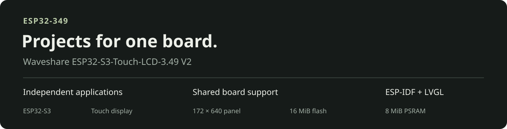

# esp32-349

[](https://github.com/byebyebryan/esp32-349/actions/workflows/checks.yml)

Projects, examples and shared board support for the
**Waveshare ESP32-S3-Touch-LCD-3.49 V2**, built with ESP-IDF and LVGL.



Each application has its own firmware, configuration, documentation and tests.
Shared components provide the panel, touch and board I/O for this hardware.

## Hardware

Built for the [Waveshare ESP32-S3-Touch-LCD-3.49](https://www.waveshare.com/esp32-s3-touch-lcd-3.49.htm),
**V2 revision**: ESP32-S3, 16 MiB flash, 8 MiB PSRAM and a 172 × 640
AXS15231B touch display. The current applications use 640 × 172 landscape. See the
[official hardware documentation](https://docs.waveshare.com/ESP32-S3-Touch-LCD-3.49)
for version identification, pinouts and schematics.

## Projects

| Project | Purpose | Guide |
| --- | --- | --- |
| **render-bench** | Bouncing-ball benchmark and display pipeline experiments | [Build and findings](projects/render-bench/README.md) |
| **notification-panel** | Clock, host telemetry, recent notifications and touch actions | [Overview, demo and setup](projects/notification-panel/README.md) |

Each is a standalone ESP-IDF application. One firmware project runs on the
board at a time; both share [display_349](components/display_349/README.md).

Project demos, behavior and validation records live with each application.

## Build

Install the [ESP-IDF Installation Manager CLI](https://docs.espressif.com/projects/idf-im-ui/en/latest/),
then run from the repository root:

```sh
./scripts/setup.sh
. scripts/env.sh
idf.py -C projects/render-bench build
# or: idf.py -C projects/notification-panel build
```

Follow the selected project's guide for flashing and any host dependencies.

## Documentation

- [Development](docs/development.md): toolchain, repository layout, shared checks and checkout migration.
- [Shared display component](components/display_349/README.md): panel, framebuffer, DMA and touch support.
- [Adding a project](docs/development.md#add-a-project): application boundaries and integration checks.
- [Presentation media](docs/media/README.md): collection artwork and project-owned demos.
