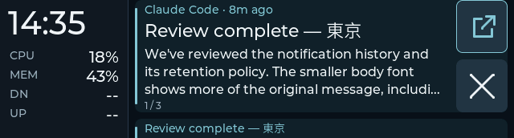
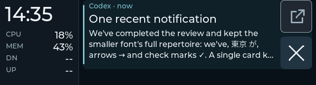
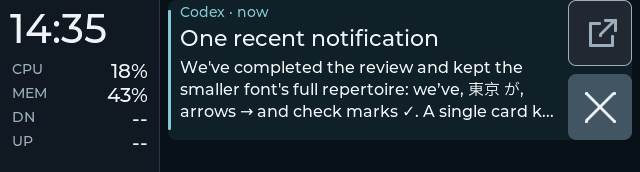

# Notification button refinement

2026-09-28, Starship. Follow-up to the accepted
[notification-only history checkpoint](notification-history-acceptance.md).

## Touch policy

The notification-history UI places Open above × in a 64 px column at the right
edge of the foreground card. Both buttons span the column and together occupy
the card's full 140 px height, separated by 8 px: each is 64 × 66 px. A
singleton keeps the stack's height, body area and control positions. Only the
next-card preview disappears; the remaining space stays clear. When actions
are not configured, × fills the column. Preview cards keep their full text
width and have no controls. The foreground title/body/footer use 376 px,
leaving the padded touch targets clear of the text. The 16 px body keeps three
lines. Older grouped and horizontal compatibility layouts retain their geometry.

The original policy canceled Open/× after 12 px of radial movement or any
departure from the original button bounds. The first refinements increased
that cutoff to 24 px and padded the targets. The user preferred the subsequent
full-height column but still observed some × presses brightening without
dismissal. This normal-feed observation did not include a raw touch trace.

Both controls now stay armed while contact remains within the original
button's 8 px padded rectangle, with no separate distance cutoff. The margin
also applies to initial contact. Initial targets split the shared gap at its
midpoint, giving every near-edge press one owner. Held/released touches may
enter the gap, but crossing onto the neighboring visible control cancels the
original action. Leaving the padded target stays canceled even if the finger
returns. Lost/reset input, removal of the captured card, and changes to its
Open revision remain cancellation conditions. Card-body swipe thresholds
are unchanged.

Captured moves update the pointer coordinates directly instead of entering the
deck's smaller swipe slop/velocity policy. A valid release invokes only the
captured card and action. Accepted control presses brighten their button,
including contacts just outside its visible edge. Feedback is removed when
the gesture is canceled; unavailable Open remains muted. A touch rejected
during card animation does not brighten any control, including the frozen
outgoing widget. The UI removes LVGL's automatic pressed style before checking
whether it can accept the contact, then applies feedback for the captured action.

## Reproduced missed-action paths

Two headless checks reproduced failures consistent with the user's report:

- With the 24 px cutoff, press `(590, 100)` and release `(614, 120)` canceled
  × despite both points being inside its visible bounds. The fixed production
  input replay emits one dismissal. Actual LVGL tests also cover diagonal
  in-bounds movement on Open and ×, including release-only motion.
- During dismissal motion, LVGL put a frozen outgoing × into `PRESSED` even
  though the callback rejected input. The added native assertion failed before
  the feedback fix; all three card slots remain unpressed on this rejected
  contact afterward.

These reproduce code defects; they do not attribute every observed physical
miss to either path.

## Open icon

The Open caption is replaced by a box with an arrow leaving its upper-right
corner. Rounded 3 px LVGL line strokes match the large × and avoid a new font
or icon dependency. The icon is accent-colored when ready and muted when
unavailable. A pending request continues to show an ellipsis instead.

## Validation

| Gate | Evidence and boundary |
|---|---|
| Input policy | Standalone C check passes with warnings treated as errors. Both controls accept in-bounds movement beyond 24 px and padded initial/release contact. Leaving the padded rectangle, adjacent-control movement and outside release-only jumps cancel. Returning after leaving cannot re-arm the action. |
| Integrated host suite | 207 tests pass during the final publication review; no host/provider implementation changed after the history rollout. |
| Font coverage | Smaller and existing composite fonts each cover 2,602 glyphs with exact repertoire parity. |
| Native Debug / Release | 10/10 CTests pass in each build. Actual LVGL pointer tests cover Open and × with in-bounds movement, padded initial/release contact, midpoint ownership, screen-edge/lower-margin input, cancellation, revision/removal/reset safety, pending/disabled rendering and blocked-animation feedback. Geometry checks hold card/body/footer/buttons constant for one or several cards. |
| Native captures | Ready, pending, unavailable and pressed frames reviewed at 640 × 172. These use production widgets with virtual data; they are not board photographs. |
| ESP-IDF | Build passes with the existing IDF 5.5.3 CMake toolchain. App binary is 2,467,136 B in an 8 MiB partition, with 71% free. Flash verified image hashes; serial hello reports `7252bb011`. |
| First physical check | On `55a692f1e`, four Open requests and four × removals were traced. The user reported more reliable input, with some misses suspected to start outside the visible buttons. Initial targets were then padded as described above. |
| Padded-target physical check | On `585c66a02`, four Open requests and four × removals were traced. The user still reported occasional misses and requested the full-height vertical control column. Padding alone was not accepted as sufficient. |
| First column observation | On `0e82b41ac`, the user preferred the column layout, requested a smaller width, and reported occasional brightened × presses without dismissal. This feedback came from normal use; the preceding isolated column recorder received no touch requests and restored normal mirroring. |
| Fixed-height/release physical check | On `7252bb011`, the user reported “seems to be working right” after a brief narrower-button/fixed-position check. Serial input recorded one Open request and two × dismissals. Open used a controlled acknowledgement without invoking desktop applications. This short check is not a measured reliability rate; raw touchscreen samples were not recorded. |
| Normal-service restoration | Synthetic cards cleared; the original daemon resumed with three retained/device cards, link true, no stale view and no pending action. Source, tests, candidate bin/ELF, capture manifest and unchanged configuration match the saved witnesses. |

## Reviewed column captures

These are production LVGL renders with virtual data, not board photographs.
The [capture manifest](button-controls-captures/manifest.json) records the
image and UI source hashes.

Multiple cards, ready Open:



Singleton with the same height, unavailable Open:



Pressed ×:



## Candidate and recovery

Candidate version is `9f8c44c-dirty`, ELF SHA-256
`7252bb011688b9652300e88b157ca1edf3060596a8e9003452b86a489cf24fff`;
the board hello must report `7252bb011`. Binary SHA-256 is
`d7057ba90b25bea5caff07f264ca0160bd59e8bc4101aa1bfba75c20e31b1373`.

Recovery images, prior source, native frames and serial evidence are stored at:

```text
~/.local/share/esp32/backups/button-release-starship-20260929T062856Z
```

The previous running column image is `0e82b41ac`; the original accepted history
image was `b9be56530`. The physical fixture pauses the normal daemon while
retaining its RAM history, clears only its synthetic session and resumes the
normal feed afterward. Configuration is not edited. `reproductions` retains
the headless failure evidence; `physical` records the new board check and
normal restoration. The earlier partial trials remain in
`~/.local/share/esp32/backups/button-touch-starship-20260929T054520Z`.
`final-observation.json`, `physical-acceptance.json` and `closure.json` separate
the observer's answer, serial action counts and restoration/parity checks.

This refinement changes firmware controls and their tests. Desktop provider,
notification retention and rendering architecture are unchanged. The board
evidence covers Starship; this checkpoint has no Snap deployment.
