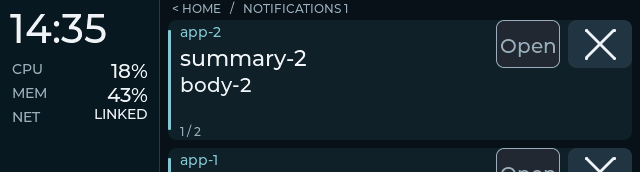
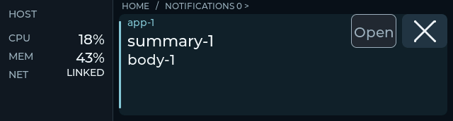
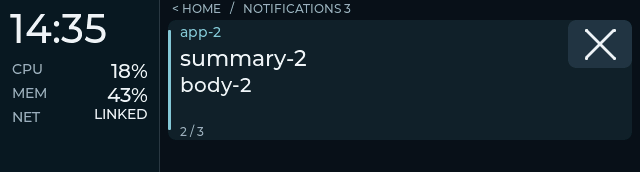

# Card arrival and dismissal motion

Implemented follow-up, 2026-09-27. This extends the
[grouped UI](grouped-ui-plan.md) and the [Open control](notification-actions-plan.md).
The user moved the remaining visual/touch check to Snap on 2026-09-28;
its second board runs the candidate. The short physical controls and motion
check passed there. The combined real Ghostty application-focus check also
passed with Snap's authorized local Niri compatibility trial.

## Behavior

Use 180 ms ease-out position transitions, keeping the telemetry rail fixed.
Motion follows the established group and card directions:

| Event | Visible transition |
|---|---|
| Automatic notification visit from Home | Notifications slides in from the right; Home moves left |
| A newer arrival takes foreground focus | The new card enters from above; the previous card moves down |
| Attention selects an older retained card | The selected card rises from below |
| × dismisses the foreground, with another card available | The outgoing card moves up as the surviving card rises |
| Last card disappears, or automatic presentation ends | Notifications moves right and Home returns from the left |
| Same-ID text/action replacement, background update, boot/session sync | Update the settled view without replaying entrance motion |

Manual browsing keeps its focus when ordinary notifications arrive. Critical
attention waits for an active drag/settle, then enters using the same motion.
Presentation expiry retains the card; actual closure and × remove it.

Removal, counts and the host input take effect immediately. A departing card
keeps only its previous widget text and geometry until the transition ends.
It cannot accept input or restore its record to the cache. Presses during
these short transitions are ignored until the finger is released, preventing
a moving control or replacement card from receiving an accidental action.

The three existing card widgets are reused. There are no new card widgets,
framebuffers, transparency layers or font assets. Updates during motion
coalesce into the latest source state at settlement. Disconnect, session
change or removal of the incoming destination cancels the transition;
completion cannot reselect a removed destination. Existing finger-following
swipes retain their own animation and are not animated twice.

## Automated evidence

The required native runner passed **9/9 CTests in Debug and 9/9 in Release**.
Production LVGL pointer/time scenarios cover:

- Entry and intermediate movement with a fixed rail.
- Immediate dismissal, frozen outgoing text and geometry, and successor growth
  from the two-card layout to the single-card layout.
- Return to Home after last dismissal, versus retained history after lease expiry.
- Repeated/held input during motion, without duplicate dismiss or Open events.
- Same-ID replacement, quiet background removal, and visible desktop removal.
- Coalesced attention, removed destination, fresh session and disconnect.
- User navigation and deferred critical attention without replaying the swipe.

All **52** grouped capture frames match between Debug and Release. The four
previous Open ready/pending/disabled/title captures remain pixel-identical
after settlement. Composed host/parser/state/UI tests wait for transitions
before acquiring the next control; native time advancement also draws the
resulting frame so button coordinates have settled.

These are production LVGL frames with controlled data, **not board recordings**.
The previews play each 15 ms sample for 60 ms to make the motion easier to
inspect; they do not measure ESP32 frame rate. Export hashes are in
[the manifest](card-motion-captures/manifest.json).

Dismiss into a surviving card:



Last dismissal returns Home:



Arrival takes foreground focus:



## Starship rollout

ESP-IDF 5.5.3 built the candidate successfully. The app is `0x21a7b0` bytes,
928 bytes larger than the reviewed Open image, with approximately 74% of the
app partition free. Comparing the 4,942-file firmware input manifest changes
only `main/ui_deck.c`; SDK settings, display pipeline and fonts are unchanged.

Starship's board `28:84:85:92:C2:20` was flashed under the daemon's sticky
pause. Esptool verified written hashes, then normal mirroring resumed.
At **2026-09-27 16:45:11 PDT**, the board announced `79f2ea4-dirty`, build SHA
**`0b7587bca`**, with grouped and notification-action capabilities. Readback
reports Home, three retained real cards, no overflow/stale view or pending
action, and enabled Open negotiation. No synthetic cards were sent for this
rollout. The existing host service remains active.

```text
firmware  b53e9b778a0b20c0e05b1d0d51fd3d18476d2f32db55d7c27c05e6237c97da9a
ELF       0b7587bca16843bd1c47ea729e36f916f1e40bbd909fd3335f5f673873965c33
```

The previous image, candidate image/ELF, firmware-input manifest, native test
logs, flash log and before/after status are preserved under
`~/.local/share/esp32/backups/card-motion-20260927T234413Z/`.

## Snap physical acceptance (2026-09-28)

The user confirmed Home/readability, fixed rail, clean browsing/group motion,
inert body taps, successful Open, disabled Open, foreground dismissal into a
survivor, and last dismissal returning Home. Both dismissals looked right.
The actual desktop callback and final empty-cache/Home readback are recorded
in [the combined acceptance record](notification-actions-acceptance.md#snap-physical-controls-and-motion).
This accepts the short physical motion/control gate on firmware `0b7587bca`;
it does not measure panel frame rate or establish long-duration stability.
The separate Open gate passed real terminal focus with the documented local
desktop compatibility setting; other application compatibility remains unverified.
