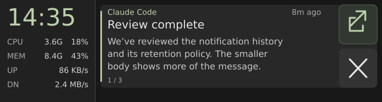
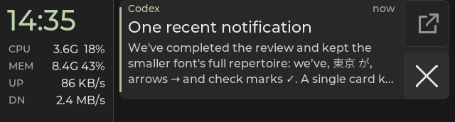
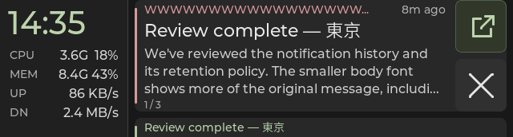
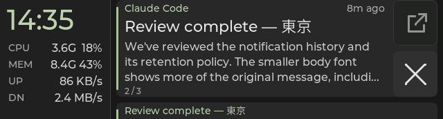

# Color hierarchy review and implementation plan

Status: notification color roles are implemented. Panel review rejected
mixed and per-row stat colors, then found grayscale alone insufficient to
separate the clock from stat values. The selected
[rail clock accent pass](rail-clock-accent-pass.md) uses a sage clock with
neutral stat values and gray labels; Snap panel acceptance passed on
2026-09-30. The implementation evidence and device identity are recorded in
that pass.
The subsequent [number/unit trial](rail-number-unit-pass.md) has been reverted
to uniform neutral readings. It also records the restored traffic spacing and
1,024-based units, with validation and panel status tracked separately.
This pass applies to the current
notification-history screen at
640 × 172. The neutral surfaces and layout stay in place. [Concept
mockup](color-hierarchy-pass.svg) shows one ordinary card; it is a vector
sketch, not a firmware capture or panel photo.

## Baseline reviewed before this pass

| Previous behavior | Assessment |
|---|---|
| `#181818` background, `#212121` rail, `#282828` card | The three neutral surfaces separate cleanly. Keep them. |
| Clock, rail values, notification title and body all use `#E6E6E6` | Too many elements claim primary attention. Preserve bright clock/title/usage percentages; soften the rest. |
| Sender and age share one gray label, or one coral label for critical notifications | The sender is quiet on ordinary cards, and the age becomes falsely urgent on critical cards. Split them. |
| Normal stripe and Open icon use sage; critical stripe and sender use coral | These are clear existing conventions. Preserve the urgency threshold and stripe. |
| Open and Close have the same neutral fill; Open has a sage glyph | The glyph helps, but a slight sage fill and border would identify Open faster. The neutral Close treatment already works. |
| Pending Open replaces its icon with gray `…` on the disabled palette | It can look unavailable immediately after a successful tap. Keep the active tint while the request is pending. |
| Stale values dim to gray; unavailable `--` readings remain bright | Dim unavailable readings too, so missing data does not compete with real usage. |

## Intent

Use sage for the rail clock, one neutral gray for complete live readings, and
a dimmer gray for their labels. Within CPU and MEM, both the detail and
percentage use the same value color.
Use muted sage for sender identity and available Open. Keep ordinary card
text neutral.
Coral continues to mean a critical notification; amber continues to mark
warnings. Color reinforces existing text and icon cues rather than becoming
the only way to understand a state.

| Element | Selected color | Role |
|---|---|---|
| Background, rail, card | `#181818`, `#212121`, `#282828` | Keep current neutral surfaces |
| Rail clock | `#BBD1AB` | One accent distinguishes time from the neutral stat block |
| Notification title | `#E6E6E6` | Primary card information |
| Notification body | `#C8C8C8` | Readable but quieter than the title |
| Rail labels and invalid/stale readings | `#A8A8A8` | Supporting information in the left rail |
| Age, counts, empty state | `#A8A8A8` | Supporting information in cards |
| CPU frequency and percentage, MEM amount and percentage, UP/DN complete readings | `#D4D4D4` | Uniform neutral values and units, brighter than row labels |
| Ordinary sender and ready Open icon | `#BBD1AB` | One brighter sage for small text and the action glyph |
| Normal card stripe | `#AFC19E` | Keep current sage accent |
| Ready Open: fill, border | `#30382F`, `#536150` | One restrained actionable control |
| Ready Open pressed fill | `#405044` | Visible press feedback |
| Pending Open | Ready fill/border with `#BBD1AB` ellipsis | Shows that the tap was accepted and work is in progress |
| Close: fill, icon | `#333333`, `#E6E6E6` | Keep the current neutral local dismiss action |
| Close pressed fill | `#404040` | Keep current press feedback |
| Disabled Open | `#242424` fill, `#383838` border, `#929292` icon | Dim every part of the unavailable control |
| Critical sender and stripe | `#D79A9F` | Keep current urgency meaning |
| Warning text | `#D4BB8D` | Keep current warning meaning |

The clock uses the existing sage accent while all stat readings stay neutral.
Starship panel checks found a split color within CPU/MEM rows inconsistent,
four row accents busy, and neutral brightness changes insufficient to
separate time from readings. One accented clock makes that distinction while
keeping the compact readings a single block. Invalid/stale readings and an
unavailable clock become secondary gray.

The rail already has separate labels for the CPU/MEM details and percentages,
so their colors can change without moving columns. In the card header, the
sender takes sage while the age remains gray. The previous firmware combined
both into one label; the implementation splits that label and reserves a
fixed right-aligned age area. A long sender should truncate before it reaches
the age or action column. The title stays bright; the body moves one step
quieter without reducing its font size. Card position and action feedback
remain secondary gray.

Open uses a subtly tinted background as well as a sage icon, so its meaning is
visible beyond the glyph color. Pending Open keeps that tint and replaces the
icon with a sage ellipsis; unavailable Open dims its border, fill, and glyph
together. Close keeps its current neutral appearance: coral is reserved for
critical notification content, and Close only dismisses the device copy.
Both buttons keep their present size, positions, and touch behavior.

Calculated sRGB contrast against the proposed surfaces is about 11.8:1 for
primary text, 9.8:1 for the rail clock, 10.9:1 for live rail values, 6.8:1 for rail labels,
8.8:1 for body text, 6.2:1 for card metadata, 9.0:1 for sage sender text,
and 7.4:1 for the ready Open icon.
The proposed colors also map to distinct RGB565 values. These are useful
sanity checks, not a prediction of the panel's perceived colors.

## Implementation plan

1. Add semantic role tokens in `main/ui_theme.h` for body text,
   brighter sage text, and ready/disabled Open surfaces. Preserve the existing
   surface, warning, and critical tokens. Do not add colors for individual
   apps or metrics.
2. Apply rail and card roles in `main/ui_deck.c`. The CPU/MEM detail and usage
   labels are already separate. Dim invalid and stale values. Split the
   foreground history sender/age into two labels, reserve a fixed area for the
   right-aligned age, and truncate a long sender before it reaches that area.
   Keep age hidden on neighboring previews and in the older deck modes.
   Render ready, pressed, pending, and unavailable Open with the state colors
   above. Leave button geometry and input handling intact. The three new age
   labels fit under the current 40-label allocation limit, but verify the
   count.
3. Apply matching text roles in `main/ui.c` where the legacy card and sender
   appear, while preserving configured zone colors.
4. Extend the native history captures in `tools/native_ui/test_groups.c` to
   include a long sender, critical sender with gray age, unavailable rail
   values, and ready/pressed/disabled Open. The native fixture already renders
   through RGB565, so review its normal, empty, critical, stale, and disabled
   frames at actual size. Run the native Debug/Release suite and firmware
   build.
5. On a connected board, make one brief visual pass through ordinary,
   critical, and unavailable Open states. Confirm readability, muted color,
   fixed rail columns, no header overlap, and discernible button states.

The design is accepted when hierarchy remains clear at actual size, critical
color stays confined to the sender and stripe, age remains neutral, and the
rail and buttons remain readable on the panel. Native renders verify layout
and pixel output; the brief board pass verifies perceived color.

## Source and native evidence

The implementation updates `main/ui_theme.h`, `main/ui_deck.c`, and `main/ui.c`.
`tools/native_ui/test_groups.c` covers rail value states, sender/age
separation, long sender truncation, and Open's ready, pressed, pending, and
unavailable palettes. Fresh native Debug and Release builds each passed 10/10
CTests. The ESP-IDF v5.5.3 firmware build passed. `git diff --check` passed for
the tracked source changes.

These [native captures](color-hierarchy-captures/manifest.json) are full-size
RGB565 fixture renders converted from PPM to PNG, not board photographs. The
critical card shows a long sender truncated before a gray `8m ago`; the
unavailable rail shows gray placeholders; Open's pressed, pending, and
unavailable states have distinct treatments. A sample PPM/PNG comparison had
zero changed pixels.

## Earlier deployment and trial history

The records below describe successive experiments. Their initial pending
checks have been superseded by the accepted sage-clock palette and uniform
readings recorded in the [clock pass](rail-clock-accent-pass.md) and
[final rail treatment](rail-number-unit-pass.md). The linked captures above
show the sage-clock baseline, not each earlier trial.

### Initial Snap deployment

On 2026-09-29, Snap's clean `b897589` checkout received the reviewed source
and capture files. The synced source hashes matched the Starship worktree. A
fresh ESP-IDF v5.5.3 build on Snap produced app binary SHA-256
`a47a852df01e92bfb85f88468be83135af94d1a97a5ab113146fe0e93bab22b2`
and ELF SHA-256
`0378efe7d1b2c39256ebd4f833da2088da03eacce0fceb232689470cf819a229`.

Flashing the connected ESP32-S3 (`28:84:85:92:c4:3c`) used `349ctl pause`,
`idf.py flash`, and `349ctl resume`. The flash tool verified the written
hashes. The new boot log reported `b897589-dirty`, ELF SHA prefix
`0378efe7d`, a successful display init, and a 12-card sync. The host then
reported a live link, notification-history mode, non-stale deck, and current
dashboard values. A later short readback showed advancing host revisions and
firmware alive logs with `host=yes`; it was a short health check, not a soak.
Snap's source checkout was dirty with that trial, matching its deployed
firmware. The user was away during that flash, so this readback alone did
not establish visual acceptance.

### Starship trials

On 2026-09-29, Starship's connected ESP32-S3 (`28:84:85:92:c2:20`) was
flashed from the local source worktree. Its app binary SHA-256 is
`c3859e388d46a77537e07cf75cc1e11613b26fe2b015db6da25ff0104ca47849`
and ELF SHA-256 is
`ca161f3244d3709d6ee465642ede0ec6e5803c292f501e889f6b65f2476bd26a`.
The flash tool verified the written hashes. The boot log reported ELF SHA
prefix `ca161f324`, successful display initialization, and a committed card
sync. `349d` resumed with a live link, a non-stale history deck, and changing
dashboard values. An isolated `COLOR CHECK` card was injected for the brief
panel review; this readback confirms delivery but does not establish perceived
color or visual quality.

The first Starship panel review found the warm CPU frequency and memory amount
visually mismatched with the white percentages. The corrected source gives
each CPU/MEM row one neutral color, retaining warm UP/DN rates. The targeted
native grouped UI check and a new firmware build passed. The native RGB565
captures were refreshed at that stage. The revised Starship app binary SHA-256 is
`c5db195d2482709e8c969c0a8409bd1d36a3fe77d76fd501ed7661a36e752211`
and ELF SHA-256 is
`78bce8671570e9a21611cbd33ea493f62c09e0d6c2daf39ff5abb49fd480a99e`.
Its flash hashes verified; the boot log reported ELF prefix `78bce8671`,
a three-card sync, and display startup. The host link is live, with a non-stale
deck.

The user suggested a distinct muted accent per rail row. The trial assigns
sand to CPU, lavender to MEM, sage to UP, and teal to DN, keeping both
CPU/MEM values the same color within each row. Targeted Debug and Release
`native_ui_grouped` tests and a firmware build passed. The refreshed native
captures and vector mockup show the trial palette. The Starship app binary
SHA-256 is
`e24ef88007e75696778eb4ecb476d5fc353b3a792ae8a4f404361f6db7ecb009`
and ELF SHA-256 is
`38b01f617115feb0929a8c73d7f5c5bd292a913f678ebb8626fdd94937df425d`.
The flash hashes verified; the boot log reported ELF prefix `38b01f617`, a
five-card sync, and display startup. The host link resumed. The following
panel feedback requested a stronger MEM color.

The user found the first lavender MEM values too close to the gray `MEM`
label. The revised `#D5B3E4` has more chroma and lightness while retaining
the same row geometry and state colors. The targeted Debug and Release native
grouped UI checks and firmware build passed; the RGB565 captures were
refreshed. Starship's app binary SHA-256 is
`fe1ad121450555a626dbaaca124cd205fff052e6dfb0373c9b883f5ba76136de`
and ELF SHA-256 is
`11ddcfa96f0f722833b5964cb0ada9d7147dcee1d87b6460f599e8521a6f1e53`.
The flash verified, the boot log reported the matching ELF SHA prefix and a
nine-card sync, and the host link resumed with current dashboard values.
The revised MEM color stood out more, but the user questioned the four-color
treatment.

The four-color treatment felt busy on the narrow rail. The next trial uses
`#E6E6E6` for all live CPU/MEM/UP/DN values, `#A8A8A8` for labels and stale
values, and keeps notification sender, urgency, and Open accents. Targeted
Debug and Release native grouped UI checks and the firmware build passed;
the RGB565 captures and vector mockup were refreshed. The Starship app binary
SHA-256 is
`b8eff582537523cf819bc9f25d19bd67a5da7010f1a0be058b5439f1d1c8e40c`
and ELF SHA-256 is
`b5bd5cccf3ef1bfb209f8159249f7e56364d07475c60943050578c03bd548c13`.
Flashing verified the image hashes. The boot log reported the matching ELF
prefix and an eight-card sync; the host link resumed with live dashboard
values. The user then requested a uniform neutral tone to separate readings
from time.

The user proposed a single neutral tone to separate live readings from the
clock without reintroducing per-row hues. The next trial uses `#D0D0D0` for
all live stat values, between the `#E6E6E6` clock and `#A8A8A8` labels.
Targeted Debug and Release native grouped UI checks and the firmware build
passed; the RGB565 captures and vector mockup were refreshed. The Starship
app binary SHA-256 is
`52352de63a25c0a2413aac0bdf9746fec3a10b568485f3be5b144df12bff92a1`
and ELF SHA-256 is
`80c36f49db0abb5b3af3400d49800914ff1011795fdca319a12c8a269cc9d677`.
The flash tool verified the image hashes. The boot log reported the matching
ELF prefix, an eight-card sync, and display startup; the host link resumed
with live dashboard readings. The next panel feedback found this value shade
too close to the clock.

The user found `#D0D0D0` nearly indistinguishable from the clock's white on
the panel. The subsequent trial used `#C0C0C0` for live values and `#949494`
for rail labels and invalid/stale readings. This produces approximately
12.9:1, 8.9:1, and 5.3:1 contrast against the rail for clock, values, and
labels respectively. Targeted Debug and Release native grouped UI checks and
the firmware build passed; RGB565 captures and the vector mockup were
refreshed. The Starship app binary SHA-256 is
`4e8de60d0694d4f1fd3c49c0dacc6a34025f5c6c5b8a8aab81da2f43f67266a3`
and ELF SHA-256 is
`47c0b21d044f10c89c960a3f84265ab92fa6fc78220531f62052ec344bdda7a8`.
The flash hashes verified. The boot log reported the matching ELF prefix, a
seven-card sync and display startup; the host link resumed with live
dashboard readings. The user found the grayscale steps still too close on the
panel; that rail treatment was rejected. The next direction, since accepted,
uses an accented clock with neutral stat values, described in
[rail-clock-accent-pass.md](rail-clock-accent-pass.md).
