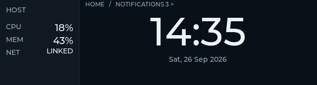
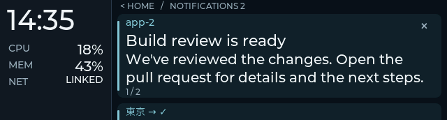
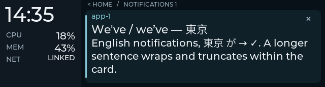
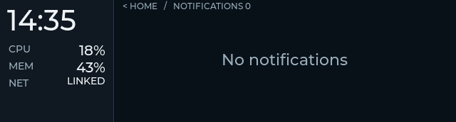
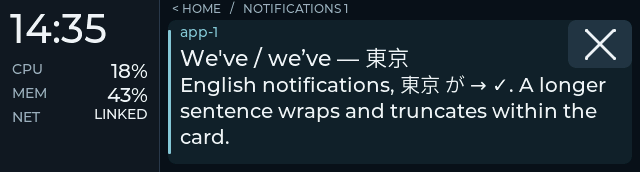

# Grouped UI acceptance evidence

2026-09-26, Starship. **The integrated automated and short physical gates
passed on firmware `be39d5e49`.** This document separates software, serial
and user-observed evidence. The physical results below are for this grouped
design, rather than an extension of the earlier swipe trials.
The subsequent close-button refinement is accepted on **`604fd70da`**, the
current Starship image; its focused evidence is recorded at the end.

The implementation follows [the direction](grouped-ui-plan.md),
[execution plan](grouped-ui-execution.md), and
[exact wire contract](grouped-ui-protocol.md). Implementation commits are
`1949e0c` (host retention), `ae1366e` (grouped UI and automation), and
`ffe1cbf` (larger close control), following `bee6cab`. The recorded binaries
were built before those commits; their hashes below identify the deployed
images. Snap has not received this implementation.

## Accepted implementation

- Fixed 160 px stats rail; bounded horizontal Home/Notifications groups.
- Empty Notifications remains reachable with a clear message and route Home;
  removing the last card still returns Home.
- Bounded vertical whole-card navigation with a 24 px next-title peek, two
  body lines for multiple cards and three for a singleton without overflow.
- At most 32 retained records in daemon RAM, separate from active desktop
  associations and automatic presentation leases. Timeout returns Home;
  manual browsing has no return timer. × removes the retained record locally.
- Capability-gated legacy active-card behavior, session-scoped deltas,
  generation-safe attention and cold-boot input handling.
- Shared production UI/fonts in headless LVGL replay and an SDL viewer;
  composed host → production parser/state → LVGL → host-input tests.

No rendering pipeline or generated font assets changed. The font descriptor
initialization moved into a shared helper so native captures use the same
fallback chain as firmware. The existing input policy supplies both axes
with different geometry; there is one axis owner per gesture.

## Automated evidence

| Gate | Result and scope |
|---|---|
| Host | 137 tests passed, including serialized PTY lifecycle/reboot, closure reasons, bounded identity metadata, offline eviction and shared display-ID allocation |
| Native LVGL | Debug and Release: 8/8 CTests each; real production widgets/fonts, virtual pointer/time, legacy and grouped interaction, plus recorder self-test |
| Composed path | Host serializer → production cJSON/parser/state → same LVGL fixture → actual input envelopes → daemon; includes held replacement/critical/sync and captured-text pixel comparison |
| Policy | Group and existing deck/input checks passed, including the group policy under ASan/UBSan |
| Supporting parsers/conversion | Dashboard parser checks and rotation/shadow conversion with scalar-reference/canary comparisons passed |
| Production parser/state safety | 109 checks passed under ASan/UBSan on the final source; process-lifetime state buffers have no teardown API, so leak detection was disabled |
| Font coverage | 2,602 glyphs in both 20/22 px text assets, exact parity with the existing 14/16 px repertoire; clock subset unchanged |
| Legacy image regression | At-rest and mid-drag captures byte-identical in both build modes to the pre-change baseline |
| IDF build | ESP-IDF 5.5.3 firmware builds; app partition has approximately 74% free |
| Board serial | Passed on firmware ELF prefix `be39d5e49`; actual USB cache/lifecycle/staging/readback and one existing periodic health sample |

Native adapters replace allocation, locks, virtual RTC/platform time, USB
transport, link state and descriptor identity. The native results do not
establish ESP32 scheduling, panel transfer, actual RTC peripherals or
capacitive touch behavior. The SDL viewer smoke uses the dummy driver;
rendered captures were visually reviewed directly.

Legacy RGB capture SHA-256:

```text
at-rest   37440761a512fd801f2c741775fc6105c292823e0a30753592090fc83bc8f7cc
mid-drag  b5b88557601f920eed8ca6071f1c9cd4a3eff2d1318996c263b559203b2cfae7
```

Those legacy pixel comparisons describe the initial `be39d5e49` grouped
implementation. The close-control follow-up below intentionally changes the
button and reserved header width in both grouped and legacy card views.

### Review corrections covered by automation

- A short acquired drag that snaps back must acknowledge a newer normal
  presentation generation sent while pressed; otherwise host and UI manual
  mode diverge. The composed regression covers the canceled navigation.
- A held × release must consume newer normal attention without changing the
  captured selection before sending browse/dismiss. Critical attention stays
  deferred. The composed regression checks host and device manual state.
- A cache mutation can precede the UI's next published frame. Serial readback
  now snapshots cache/view fields atomically and exposes `view_pending` when
  their identities disagree, rather than emitting a contradictory view.
- An expired queued arrival delivered during link loss remains retained but
  cannot resurrect the legacy active projection.
- Eviction also bounds the active projection during link loss after grouped
  mode has been negotiated, keeping both host lists within 32 records.
- Cold boot accepts generation 0 input without replaying an earlier visit;
  new attention still advances the daemon's monotonic counter.
- The referenced design requires an available empty Notifications group.
  The completion audit caught a missing path; native and composed checks now
  cover empty entry/exit, inert vertical motion, and a held empty view during
  an arrival. Last-card removal still returns Home.

## Reviewed native layout

These are 640 × 172 native LVGL captures with virtual data and production
fonts, **not board photographs**. Their hashes are in
[the capture manifest](grouped-ui-captures/manifest.json). They are reviewed
examples; tests do not automatically replace this manifest as a baseline.

Home:



Two cards, long body and next-title peek:



Singleton with punctuation/CJK:



Empty Notifications:



## Starship deployment and serial evidence

The previous accepted firmware, ELF and original config are backed up under:

```text
/home/bryan/.local/share/esp32/backups/grouped-ui-20260926T074823Z
```

The candidate binaries, serial trace, console log and structured result are
kept there in `candidate/` and `board-probe/`. The physical board identity is
`28:84:85:92:C2:20`. Configuration SHA-256 before this goal:

```text
61dacdef4cdfca91efe08658285379905b16c9237960879f413152c77e678cdf
```

The probe isolates synthetic state with sticky daemon pause, resets/opens the
serial link, verifies cache and presentation semantics, clears its synthetic
cache, then restores normal daemon mirroring. Serial output establishes cache,
lifecycle and published-view behavior; it cannot prove displayed pixels.
The first probe required a boot-ready wait, then exposed the readback race
above; those are development trials, not passing candidate acceptance.

Final candidate SHA-256:

```text
firmware  7def92f2123236bdd2850d6ad3bd3c2db19acf51afa114f68bb219681828e0bb
ELF       be39d5e497668d8106a38a2e496a92e7736d329673ffdc8f4e061d7e233416fd
```

The board announced `bee6cab-dirty`, build SHA `be39d5e49`, and all three
required capabilities. The isolated serial probe passed:

- 33 host records bounded to the newest 32, truthful IDs/count/overflow.
- Replacement delta moved ID 31 to newest order without duplication.
- Finite presentation returned Home and retained all 32 records; a longer
  same-generation update did not renew it. Ordinary sync did not replay it.
- Persistent critical presentation ignored an older-generation end message.
- Explicit close removed the selected record and returned Home.
- Malformed staged grouped metadata preserved the committed cache and
  requested one recovery sync. Wrong-session notify/close were ignored.
- A changed session reset to Home/generation 0; legacy sync selected the
  fallback path; final synthetic cache was cleared.

At the existing 10 s health interval (11.583 s from boot), minimum free internal
memory was **75,563 bytes**, minimum PSRAM **7,923,996 bytes**, and LVGL task
stack headroom **2,476 bytes**. CPU idle percentages were unavailable on this
first sample. This short, mostly idle serial run does not measure animation
rate or long-duration stability. Physical motion was checked separately below.

The original configuration hash remained unchanged. The daemon was restarted
to load the reviewed host code and resumed normal mirroring after the probe.
After the headless probe, normal-service readback showed: daemon active, paused false, link true,
notification mirror active; device cache/overflow zero, dashboard enabled,
stale false, grouped mode enabled, Home selected, no presentation and no
synthetic cards. The normal negotiation confirmed build SHA `be39d5e49`.
The backup directory also contains `normal-device-cards.json` and
`normal-host-status.txt`. These are serial/service observations, not a visual
baseline confirmation from the user.
The final host bounds correction was loaded with a service restart, then the
same firmware identity and normal grouped readback were verified again. A
daemon restart clears its RAM-only history. `candidate/source-manifest.json`
records this refreshed host source alongside the unchanged firmware sources;
`automation/` retains the final host/native logs and recorder cleanup checks.
The prior `df8f46f4d` candidate/probe remains archived in suffixed directories;
it predates the empty-group correction and is not the final acceptance image.

## Starship physical acceptance

The opt-in [physical recorder](../tools/run_grouped_smoke.py) completed;
its [operator guide](../tools/native_ui/README.md#opt-in-physical-recorder)
describes the short session. The user was at Starship for one isolated
look/touch/timeout/replug session on the same `be39d5e49` build. Its routine
native self-test covers setup, local removal,
timeout retention and fresh-process recovery. Fake-IPC checks cover cleanup
on normal exit, setup failure and a lost pause reply, and refusal to take an
existing pause. These checks validate controller logic, not real serial
replug timing or physical touch. The recorder preserves the normal daemon's
RAM history while paused and verifies its original session and retained
count after resuming. The physical recorder exited successfully and verified
normal restoration without restarting the daemon or changing configuration.

Artifacts are under the backup directory's `physical-smoke/`:
`trace.jsonl`, `console.log`, `result.json`, `serial-summary.json` and
`human-observations.json`. The latter contains the user's actual answers,
kept separate from serial assertions.

| Physical check | User observation | Serial evidence |
|---|---|---|
| Home/text readability, fixed rail, horizontal groups, vertical cards and short cancel | “Layout and controls work” | Browse inputs and stable grouped readback during the session |
| Announced 10 s presentation, then browsing its retained card | “Returns Home; card is retained” | Home observed 10.363 s after sending the presentation; all four records retained. This includes readback polling delay |
| Actual × followed by USB replug and browsing | “× removes card; recovery looks right” | Dismiss input for ID 100003; changed boot ID, Home/generation 0, surviving IDs 100000–100002 and no presentation after replug |

The first combined check produced no × input, so the final replug check
included an explicit tap. The recorder then received exactly one dismissal
and verified its removal. The measured replug interval was **7.407 s** from
disconnect detection to reconciled readback, including the unplug interval,
boot and polling. This is one recovery trial, not a general latency bound.

During this short session, 25 periodic health samples recorded minimum free
internal memory **81,031 bytes**, minimum PSRAM **7,923,996 bytes**, and LVGL
task stack headroom **2,556 bytes**. These are sampled resource observations
across ordinary touch activity, not a continuous motion benchmark or FPS
measurement. The user reported clean motion and working controls. No soak
or powered-host-sleep gate was added.

At recorder exit, normal restoration returned to original daemon session **775062740**, with
three normal retained records, Home selected, no presentation, stale false,
and pause false/link true. The synthetic session was **775062742**, so matching
numeric card IDs in the normal collection do not represent surviving test
cards. The original configuration hash and firmware/source manifest were
verified again. The service kept its RAM history and resumed its own source
stream; restoration snapshots are retained alongside the physical artifacts.
Later normal arrivals continued in that original session; the final live
snapshot contains four normal records. Counts are point-in-time observations.

Completion audit against the referenced direction and execution plan:

| Requirement | Authoritative evidence | Status |
|---|---|---|
| Fixed rail, Home/date, whole cards, bounded two-axis motion, empty group | Production `ui_deck.c`/`group_input.c`, native pointer cases, reviewed captures and user's layout/touch result | Passed; empty-group edge cases covered natively |
| Stable captured identity/text and safe arrival/removal/settlement | Direct native cases and composed held replacement/critical/sync pixel comparison | Automated gate passed |
| Bounded retention, independent attention, manual takeover and critical deferral | Host controlled-clock/PTY tests, composed round trips, final board lease readback | Automated gate passed |
| Replacement, local ×, closure reasons, eviction and monitor/desktop-ID lifetime | Host source/state tests, parser/UI/host round trips and physical × with serial removal | Passed |
| Session/generation safety, cold boot and ordinary sync semantics | Host reboot tests, production parser tests, composed/native cases, serial session probe and physical replug | Passed |
| Atomic bounded wire, malformed transfers and legacy compatibility | Production parser/host tests, serial recovery/legacy probe, unchanged legacy captures | Automated gate passed |
| Shared replay/capture/viewer, one routine command and explicit adapter limits | Native CMake targets, Debug/Release CTest, native test guide and trace artifacts | Implemented and checked |
| Existing renderer, fonts and USB; firmware/resource checks | Unchanged driver/font/USB sources, coverage audit, scalar shadow tests, IDF build and final board health sample | Gate passed for recorded short serial scope |
| Physical motion, readability and no visible artifacts | User's Starship layout/touch observation on `be39d5e49` | Short physical gate passed; no numerical comparison with prior builds |
| Announced visible timeout, retained browsing and replug layout | User's physical answers plus recorder trace/readback | Passed |
| Normal mirroring restored and exact evidence captured | Active service, resumed flag/link, build negotiation, original session/count readback, configuration hash and backup manifests | Passed after physical session |

The requested goal's gates are closed for Starship and the recorded scope.
Held arrival/replacement/removal races remain automated; the session required
no hold-and-inject choreography. The implementation commits above preserve the
accepted source, and this evidence
does not cover Snap deployment or long-duration stability.

## Close-control usability follow-up

The user found the initial × too small on the physical display. The target
is now **64 × 48 px**, up from 48 × 36 px (78% more touch area), with a
**28 px cross drawn using 3 px strokes** and a distinct button background.
The app/title reserve its width with a gap; body line counts stay the same.
The same control is used in grouped and legacy card views.



Debug and Release each passed **8/8 native CTests**, including a tap in the
new lower-left target area and cancellation of a drag starting there. The
firmware built and was flashed on Starship as **`604fd70da`**. The recorded
source comparison against the accepted grouped image changes only
`main/ui_deck.c` among firmware/host runtime sources. Fonts, driver, USB and
configuration remain unchanged. No host-policy change required rerunning the
host suite.

Binaries, source hashes, native/build/flash logs, the capture and the focused
physical recorder are under
`/home/bryan/.local/share/esp32/backups/close-target-20260926T165115Z`.
The user reported **“Much better; closes correctly.”** That first trial had
no tap in its serial trace, so only the focused tap was repeated. The second
answer, **“Tapped; CARD B appears,”** matches the recorded dismissal of
CARD C (ID 100002), cache reduction to IDs 100000/100001 and focus on CARD B
(ID 100001). Both trials used persistent cards and the same firmware, with
normal mirroring restored afterward. The retest's structured result confirms
return to the original daemon session; no code change or repeated full
acceptance sequence was needed.
