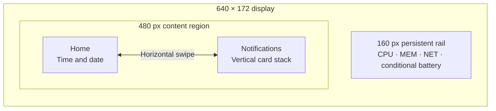

# Grouped UI and retained notifications — reviewed direction

Reviewed direction, 2026-09-26. The implementation now follows this
design; **Starship's automated and short physical gates passed** on
`be39d5e49`. Resolved geometry and wire
rules are in [the protocol contract](grouped-ui-protocol.md), and current
evidence is in [grouped acceptance](grouped-ui-acceptance.md). The proposals
below preserve the design review context. The previously accepted
[drag-and-snap deck](swipe-deck-plan.md), committed in `f17ad67` with renderer
simplification in `c88eeb9`, remains the compatibility fallback. Its historical
firmware and physical trial identities remain in [ACCEPTANCE.md](../ACCEPTANCE.md).

## Requested direction

- Keep persistent host information in the left quarter of the display.
- Use the right side for horizontally browsable **groups**.
- A group can contain one card or a vertically browsable stack of cards.
- Make time/date the Home group and notifications a separate group.
- When a notification's presentation time ends, return to Home and retain
  the notification for later browsing.

The first implementation should contain only **Home and Notifications**.
Other group content, app-specific notification groups, and a configurable
group editor are later decisions. The generic group concept should not require
those features to establish the interaction model.

The [execution and automated acceptance plan](grouped-ui-execution.md) expands
the checkpoints below. Held-gesture races become routine simulator/replay
checks; physical acceptance is a short visual/touch session plus automated
board readback, rather than repeating involved human sequences across builds.

## Design review

The direction separates ambient information, temporary attention, and manual
browsing. Horizontal movement chooses a kind of content; vertical movement
chooses a card within it. Notifications gain the full content width, rather
than sharing that width with another notification's side peek.

Four issues need explicit treatment:

1. The display is only 172 px tall. A vertical stack should have one readable
   foreground card and a restrained neighboring edge, rather than several
   equal-height strips. The exact peek height and body-line budget need a
   preview and a board readability check.
2. Two axes need one owner per gesture. Independent recognizers must not both
   act on the same press, and an automatic return must not move content under
   the finger.
3. Retention adds host state and protocol behavior. The current host removes
   cards and their desktop-ID correlation on timeout; a firmware-only change
   would lose the retained cards on the next full sync.
4. Retention needs a bound. Begin with a recent collection of at most 32 cards,
   rather than allowing old notifications and counts to grow indefinitely.

## Navigation and layout

The diagram describes navigation, not exact visual geometry.

| Element | Proposed behavior |
|---|---|
| Rail | Retain current readings, conditional rows, quiet updates, and stale marking; it never scrolls with content |
| Home | Large clock/date; notification count and a small group-navigation cue make retained cards discoverable |
| Notifications | One large card and a small vertical peek where another card exists; source, title, body, urgency, and explicit × |
| Horizontal movement | Home ↔ Notifications; a single-card group still permits group navigation |
| Vertical movement | Browse cards within Notifications; Home has no vertical action |
| Group indicator | Describe the selected group separately from the notification position |
| Card indicator | `position / retained-visible`; never imply that an evicted or uncached card is reachable |
| Empty Notifications | Keep the group available with a clear empty state and a route back to Home |

Recommended starting rules:

- Use bounded group navigation and bounded newest-to-oldest card navigation,
  with no circular wrap. Clear end cues distinguish an exhausted stack from
  an unrecognized gesture. This deliberately differs from today's circular
  horizontal card deck.
- Use one-card vertical snapping with finger-following motion. Do not add
  free momentum through many cards in the first version.
- Show a compact rail clock while outside Home, following the existing
  clock convention. The rail's container and readings remain fixed.
- Preserve the current text repertoire, 20/22 px body/title sizes, quiet
  colors, and explicit dismiss target. Do not promise three body lines until
  the vertical peek geometry has been checked.
- Give horizontal group navigation a distinct cue from the vertical card
  peek. The top/bottom edge indicates more notifications; the group indicator
  indicates another kind of content.

Vertical browsing here moves **whole cards**. Scrolling within a long card's
body is a separate interaction: combining both vertical actions would need
another ownership rule. Keep the current bounded/truncated text contract for
this first goal.

## Presentation, browsing, and retention

Presentation time and retention are different states. Timeout ends a
temporary visit; it does not delete the retained record.

The following are recommended policies for the first implementation, not
changes already made to the current service:

| Event | Group/focus behavior | Retained collection |
|---|---|---|
| New normal notification while Home is idle | Coalesce a burst, then open Notifications on the newest eligible card | Add one record |
| Presentation timeout | Return an automatic visit to Home | Keep the card |
| User begins navigation during an automatic visit | Switch to manual browsing; cancel its automatic return | Keep the card |
| User opens Notifications manually | Restore its surviving selected ID, otherwise select the newest card | Unchanged |
| Normal arrival during manual browsing | Update count without changing the selected group or card | Add/update the record |
| Critical arrival | May take focus after a held gesture and settlement finish | Add/update the record |
| Replacement | Preserve identity; refresh text when movement is settled; it may start a new automatic visit when Home is idle | Update one record, without duplication |
| × on the foreground | Select a surviving neighbor; when empty, return to Home | Remove locally through the host so sync cannot restore it |
| Host presentation timeout or desktop expiration signal | End the matching automatic presentation, if any | Keep the record |
| Explicit desktop dismiss/close | Reconcile a removed selection using the same safe removal rules | Proposed default: remove the associated record |
| Retention limit exceeded | Preserve the selected ID if it survives; reconcile safely if evicted | Evict the oldest retained record |
| Full sync or USB reconnect | Reconcile by ID; a full sync is not a fresh notification arrival | Restore the retained collection from the host |

Use the existing effective app-timeout rules for presentation: a positive
timeout is honored, `-1` uses the configured fallback, and `0` has no automatic
timeout. A **10 s normal fallback** is the proposed starting value; critical
notifications keep their separately configured policy. This proposal does not
change desktop settings or claim that the source-code fallback is already
10 s. Manual navigation can always leave a persistent presentation.

Each presentation has an identity/generation. A timeout for an older card or
an earlier replacement must not return a newer presentation to Home. Bursts
use the existing 300 ms normal-arrival coalescing as a starting point. Their
presentation window starts when coalescing releases the newest card for
presentation; delayed delivery consumes that interval rather than starting a
fresh one. Repeated full syncs must not restart it.

Manual browsing has no automatic return timer in the first version. A held
press owns its content; ordinary arrivals, text replacement, and timers must
not change it underneath the finger. A retained critical arrival is validated
and applied only after the interaction finishes. Removal or eviction can
cancel motion safely, as in the current swipe policy.

Record order is newest first by arrival/update. A replacement retains its ID
and moves to the newest position, but manual focus remains on its selected ID.
Freeze copied card text and captured neighbors during motion; reconcile the
new order after settling. Positions may change without changing identity.

## Ownership, limits, and recovery

### Host

- Own retained records, ordering, presentation eligibility/deadlines, and
  dismissal. The device owns the selected group, selected card, gesture, and
  transition between automatic and manual browsing.
- Start with at most 32 retained records for this single host/board. Eviction
  affects this display's collection, not the desktop notification center.
  Retention is a count bound, not a promise of a day's history.
- Keep replacements correlated after presentation timeout while the desktop
  notification remains live. Today `_expire_due()` calls `_forget_local()`
  and `_on_close()`; that path must split presentation completion from record
  removal and desktop-ID lifetime.
- Preserve the reason for `NotificationClosed`: expiration, user dismissal,
  and an application close require different retention decisions. Do not infer
  a desktop close merely because its popup disappeared.
- Bound retention-specific ID correlation, pending reply tracking, and
  local-removal suppression as well as retained text. Specify the metadata
  limits and stale-reply handling with the wire contract. If an
  evicted/dismissed desktop ID is later updated, treat that update as fresh
  eligible content; stale replies must not restore
  its discarded record. Replacement of a locally dismissed record can return
  it under the existing behavior.
- Initially retain history in daemon memory. It survives a board replug while
  that daemon stays running; daemon/host restart starts empty. If host sleep
  removes board power while the daemon survives, wake uses that same recovery
  path. Disk persistence across daemon restart/reboot is a separate decision.
- On notification-monitor loss, end automatic presentation and invalidate
  desktop associations, while retaining the bounded text collection. Scope
  identities to the monitor/host session so reused desktop IDs cannot replace
  unrelated older records. Old-session records have no desktop actions.

### Firmware and wire

- Reuse the bounded committed/staging caches, atomic chunked transfers, encoded
  frame limits, and serialized snapshot/delta ordering.
- Define a new capability for retained notifications/grouped UI before rollout.
  Its exact name and fields are not frozen by this design document. Unknown
  JSON fields alone cannot provide compatibility for changed event semantics.
- Keep current `notify`/`close` behavior for the existing active-card UI and
  legacy firmware. A capable host projects the active set for old firmware and
  the retained set plus presentation state for new firmware. New firmware
  paired with an old host keeps the existing active-card UI; grouped retention
  is enabled only when both sides support its contract.
- Counts describe retained, locally visible cards rather than currently active
  desktop popups. Evicted records are not included in either the position count
  or overflow. Start with retention and device capacity both 32; if a smaller
  cache is negotiated, label any uncached retained count separately and never
  imply it can be browsed without paging.
- Distinguish presentation completion from retained-record removal on the new
  path. Include enough version/session identity to reject an old completion
  after replacement, eviction, or a source restart.
- Specify remaining presentation time for delayed delivery; do not give a
  queued notification a fresh full timeout just because USB recovered. The
  device can use a monotonic timer for the supplied remaining interval and
  must report manual takeover so subsequent host updates cannot restart it.
- Treat full sync as state recovery, not arrival replay. Cold boot starts on
  Home with the retained count available; an ordinary resync preserves the
  current surviving selection. Only fresh eligible arrival events request an
  automatic visit.
- A new host process/session clears obsolete focus, gestures, and dismiss state
  before accepting reused IDs. A link loss cancels movement, marks the rail stale,
  and keeps the clock/connection state available without presenting old cards
  as new alerts.

Local × defaults to a display-only removal. A separately enabled propagation
mode can also close a still-live desktop notification; a history-only card
must not send a close against a reused or unknown desktop ID. The host must
honor display removal on the next periodic sync and reconnect.

## Gesture and rendering budget

Use one state machine to choose horizontal group motion, vertical card motion,
button ownership, or ignored input after movement slop. Keep that choice until
release; diagonal ambiguity returns/cancels rather than switching axes midway.
A drag starting in the rail never transfers to the content area. A drag
starting on × cancels the button and does not navigate. Body taps do nothing.

LVGL has directional/nested scrolling and snapping, but the current custom
input policy rejects vertical movement. Prototype whether native scrolling
can preserve these ID/removal/arrival rules; otherwise extend the existing
explicit ownership plus LVGL animation. Choose one approach before integration.

Reuse a small fixed number of views for the visible group and neighboring
cards. Keep retained text in PSRAM; do not allocate a full widget tree or image
snapshot for every record or every possible group. Animate one axis at a time.

The current renderer uses a full PSRAM DIRECT framebuffer and rotated shadow,
with complete panel transfers. More stored groups do not inherently increase
transfer size; extra visible drawing and effects consume frame time. Retain
the tested DMA safeguards and synchronous drawing. Avoid introducing blur,
large layered transparency, zooming, or continuous animation into this goal.

Historical swipe trials measured roughly 16–20 updates/s; the initial 25
updates/s target was not reached. The cleanup's short retest reported minimum
internal heap 82,559 bytes, PSRAM 7,923,996 bytes, and LVGL stack headroom
2,668 bytes. The user found it equally responsive; there is no detailed new
motion benchmark for that cleaned image. These observations support trying
the grouped design, not a claim that it already fits or performs identically.

Accept comparable observed responsiveness and readable text, with no numerical
FPS target that reopens the discarded tuning loop. Measure the integrated
prototype's heap/stack and capture a bounded motion sample on the same board.

## Implementation checkpoints

| Checkpoint | Deliverable and acceptance |
|---|---|
| A — interaction preview | Home/Notifications, vertical whole-card stack, distinct cues, empty state, manual takeover, ×, and safe axis locking; compare peek heights/body-line budgets |
| B — host lifecycle and contract | Bounded retention, timeout versus removal, replacement correlation after timeout, dismissal/eviction, session reset, remaining presentation time, and old/new capability projections; freeze the wire fields here |
| C — firmware and native UI | Group selection plus vertical card focus, safe copied views, timer generations, manual takeover, arrival/removal/sync rules, and actual LVGL pointer tests |
| D — Starship short gates | Readability, two-axis drags/flicks/cancel, group/card boundaries, timeout returns Home with retained cards still browsable, manual reading, ×/replacement, burst/32-card bound, and replug |

Checkpoint B includes fake-device/host tests for timeout followed by
replacement, closure reasons, local removal followed by full sync, retention
eviction, delayed notify delivery, monitor restart/ID reuse, and mixed-version
hosts/firmware. Checkpoint C includes timeouts and critical arrivals during
touch, source/destination removal during drag/settle, and 0/1/2/32-card states.

Physical checks target Starship's board, the user's last confirmed location.
Check user availability for visual/touch trials and keep ordinary test cards
visible through their response; timed expiry trials need a separate announced
window. Isolate test cards and restore the exact normal mirror configuration
afterward. Record firmware/host identities and distinguish
synthetic state checks from visual/touch observations. No soak, powered-board
host-sleep gate, or Snap rollout is added.

## Decisions to settle in the first preview

- Vertical peek size versus body readability; avoid recreating the prototype's
  thin notification strips.
- Discoverability and bounded navigation at the ends of groups and stacks.
- Whether explicit desktop dismissal should remove retained cards, as proposed,
  or only end desktop association; timeout retention is already the direction.
- Critical attention during manual reading; the proposal preserves preemption
  after gesture completion, with no movement under a held finger.

Settle these policies in the preview and freeze a concrete wire contract before
firmware integration. The first implementation goal ends with reviewed source
and recorded Starship short-gate evidence. Body-text scrolling, additional
group types, disk history, app icons, and renderer experiments remain later
work driven by use.
