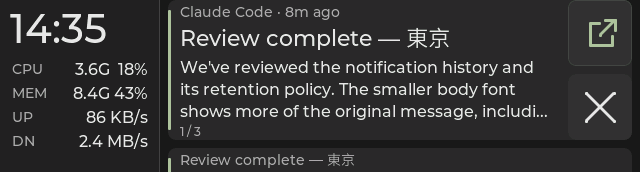
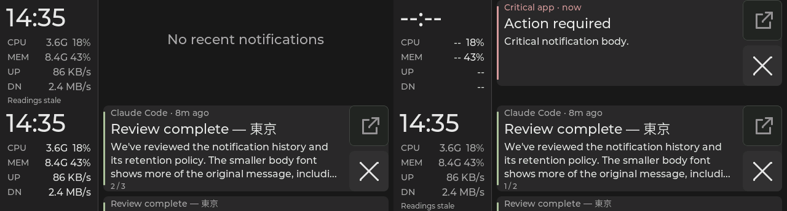

# Neutral gray and muted sage theme

Both firmware UI paths use one shared palette in `main/ui_theme.h`. The values
were selected in the local notification theme study; its rail color follows
the `#212121` Material Darker background used by the local Ghostty and Kitty
themes, with a darker `#181818` display background for separation.

| Role | Color | Use |
|---|---|---|
| Background / rail / card | `#181818` / `#212121` / `#282828` | Display surfaces |
| Button / pressed | `#333333` / `#404040` | Dismiss and ready Open controls |
| Divider / button border | `#424242` / `#454545` | Rail separator and neutral Open outline |
| Primary / secondary text | `#e6e6e6` / `#a8a8a8` | Main copy / metadata and labels |
| Accent | `#afc19e` | Normal card stripe and ready Open icon |
| Warning / critical | `#d4bb8d` / `#d79a9f` | Existing warning copy / urgency `>= 2` stripe and app label |
| Disabled Open fill / glyph | `#242424` / `#929292` | Unavailable or pending Open state |

Ordinary app and age metadata remain secondary gray. Critical urgency retains
its existing threshold and changes the stripe and app label to coral. Amber
continues to mark the existing warning text; it does not add notification
urgency behavior. Legacy configured zone colors remain honored.

## Native captures

These are synthetic, production LVGL renders at 640 × 172 from the native
fixture, not board photographs. In `notification-states.png`, the cells are
empty, critical, disabled Open, and disconnected, left to right and top to
bottom. The empty cell retains the stale and clock-unavailable fixture state;
the direct critical capture has unavailable clock and CPU details. The
individual frames were captured as PPM and converted with Python's standard
library; no pixels were recolored. The critical card used urgency 2.

The existing native Debug and Release suites passed 10/10 CTests each. These
captures verify host-rendered palette use, not panel appearance, color
calibration, touch, or live notification actions; those remain board checks.

## Starship deployment and acceptance

On 2026-09-29, the theme was built from `d0d1a53` plus these source changes and
flashed to Starship's attached board. The device's fresh hello identified
firmware `30b8a18af`; the ELF SHA-256 is
`30b8a18afccd2e1a065eb22c8402568e6d7078b2f3b6a756f806abe5d48bb5ee`.
The firmware build passed, and the runtime source hashes matched the reviewed
and compiled candidate.

Four bracketed host/device readbacks passed on the normal feed, including
live CPU, memory, and network values. The host config was unchanged, its
one-second cadence remained active, and flashing used pause/resume without
restarting the host service or clearing retained notifications.

The observer confirmed that the backgrounds looked neutral, clock/stats/card
text remained readable, and the sage Open icon looked right beside ×. This
was a palette and readability check; touch and application focus were not
retested for this color-only change.

The previous accepted image, candidate image and source, native logs, normal
feed readbacks, and observer response are preserved locally under
`~/.local/share/esp32/backups/neutral-theme-starship-20260929T082235Z`.
