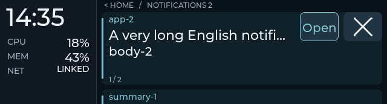
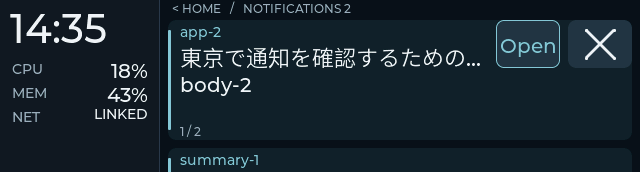
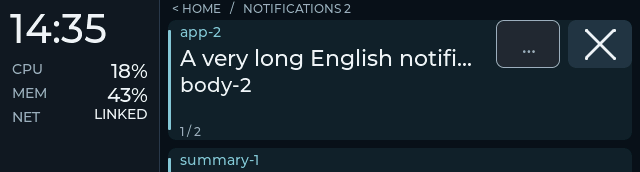
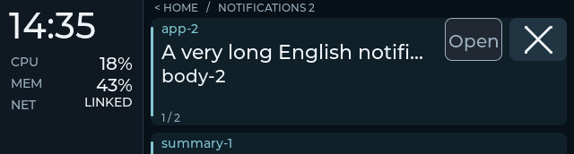

# Notification Open acceptance

Accepted on Snap on 2026-09-28, including physical controls/motion and a real
Ghostty default-action/focus result with the authorized local Niri compatibility
trial. Initially implemented on Starship on 2026-09-27. The
[design](notification-actions-plan.md) defines the feature; application and
desktop-configuration limits are recorded below.

The subsequent [card-motion follow-up](card-motion.md) adds arrival/dismiss
transitions and was deployed to Starship as `0b7587bca`. The rollout below
records the preceding Open image; the combined physical check passed on Snap.

On 2026-09-28 the user resumed the loop and moved the remaining work to **Snap**.
Snap's rollout, physical evidence and terminal focus result are below.

## Desktop provider

DMS `1.6.2-1`, Quickshell `0.3.1-1`. The scoped daemon plugin
`status349NotificationActions` loaded inside notification-owner PID `56589`.
The host's bounded `BridgeClient` successfully parsed its live status response.

- Provider core: 10 focused fake-object tests passed; `qmllint` passed.
- Live controlled producer: 12 cases passed and exactly **two** real
  `ActionInvoked(..., "default")` callbacks were received. `default` was the
  second action; the first action was `reply`.
- Cases: temporary revocation/rebind, explicit source-version change for an
  identical replacement, visible replacement, dispatch, deduplication,
  synchronous nonresident close, final local-ID fence, missing default,
  explicit desktop close, scoped plugin reload, old-token rejection, and
  dispatch through the fresh epoch.
- Every owned notification was cleaned up. This proof did not invoke a real
  application's callback and does not establish window or tab focus.

Reproduce deliberately, with the provider installed:

```sh
uv run --project host --frozen python tools/test_notification_actions_bridge.py \
  --live --artifacts /tmp/349-actions-live-proof
```

The tool sends synthetic notifications and reloads only this plugin. Its
JSONL traces contain controlled fixture text, bridge identities and callback
events. Run the native composed replay separately for device input evidence.

## Starship installation

The plugin directory is linked from this checkout into
`~/.config/DankMaterialShell/plugins/status349NotificationActions`. Scoped
discovery and enablement succeeded. Discovery is asynchronous: wait for the
plugin to appear before enabling it.

The pre-install plugin settings and `349d` config are backed up under
`~/.local/share/esp32/backups/notification-actions-20260927T212025Z/`.
Only this plugin's enablement key was added to live DMS plugin settings.
Chezmoi's existing `modify_plugin_settings.json` preserves local plugin keys;
its source repository remains unchanged. `~/.config/349d/config.toml` is
currently unmanaged by chezmoi. Starship now opts in with `device_open = "dms"`;
repository defaults remain off.

## Automated device and composed path

- Complete host suite: **172 tests passed** in 19.51 seconds, including
  bounded source metadata, manager/client response validation, stale bind
  races, disabled negotiation, revision changes, request deduplication and
  bounded results, close/dispatch ordering, and boot/reconnect handling.
  The composed replay passed again after the final host cleanup. Firmware
  owns the global 500 ms UI cooldown; the host has one pending request and
  request-ledger validation, without a separate per-card timer.
- Required native runner: **9/9 CTests in Debug and 9/9 in Release**. The
  production protocol/state fixture includes 242 checks. Production LVGL
  pointer replay covers both button centers/edges, the gap, inert body taps,
  crossed controls, leave-and-return, disabled/pending targets, held revision
  changes, removal and input reset. Legacy geometry remains available without
  action negotiation.
- Composed replay uses the real notification source, daemon/action manager,
  host serializer, production parser/state and LVGL pointer envelopes. Its
  notification owner/provider are controlled substitutes. It covers global
  pending, duplicate requests, replacement during a press, popup expiry versus
  genuine closure, and close-before-response with a newer surviving card.
  A wrong-card result cannot release the pending request.
- Review found host/manual mode surviving a final-card removal even though
  the UI returned Home. Both desktop close and local × now reset that mode
  when the retained collection becomes empty; the next ordinary notification
  can present. Explicit browsing of an already-empty group is preserved.
- ESP-IDF 5.5.3 build passed. The app occupies `0x21a410` bytes, leaving
  approximately 74% of its app partition free. A 4,942-file input manifest
  remained unchanged across the final build; the prior accepted image and
  candidate image/ELF are backed up before rollout.

These captures are native 640 × 172 LVGL output with production fonts and
controlled data, **not board photographs**. Debug and Release pixels match;
the exported PNG hashes are in [the manifest](notification-actions-captures/manifest.json).

Long English title with a next-card peek:



CJK title:



Pending and unavailable controls:





## Starship rollout and serial readback

Board USB identity `28:84:85:92:C2:20`. The firmware was flashed while
`349d` had its sticky pause set; esptool verified the written data hashes.
The daemon restarted at **2026-09-27 14:58:21 PDT**, loading the reviewed host
source and starting a fresh RAM notification history. It then resumed normal
mirroring. No test configuration or card remains active.

The board announced `79f2ea4-dirty`, build SHA **`df70d40be`**, and the new
`notification-actions-v1` capability with cache/dashboard/grouped support.
Host status confirms configuration, negotiation and provider PID/epoch;
firmware readback confirms the enabled action contract. Exact candidate hashes:

```text
firmware  69b4a2bbb948eefcbc7ac66a618ab651fdcfa7a2c492f61aa165f92b711abff5
ELF       df70d40beb965dcd5b127c85c069c227b2a498fa445fe000b081ff00c2687881
```

The owned desktop readback fixture passed through actual DMS → notification
monitor → daemon → USB → firmware. Desktop ID 32 mapped to local ID 100000:

| Step | Firmware action readback |
|---|---|
| Unique `default`, with `reply` first | Ready, revision 3 |
| Identical Notify replacement | Ready, revision 6; same retained ID |
| Replacement without `default` | Unavailable, revision 7 |
| Explicit desktop close | Card removed; Home, no pending request |

Its actual `NotificationClosed` signal was received and cleanup confirmed no
owned desktop notifications remain. This check establishes metadata/lifecycle
on the physical firmware; it does **not** simulate touch or invoke Open.
Final readback has zero cards/overflow, Home, no stale view, and no pending
action. Normal mirroring remains active and the service/link are healthy.

The backup directory above retains source-input and reviewed-source manifests,
previous and candidate images, native logs, bridge proof traces, flash log,
the owned readback probe/results, and final daemon/firmware snapshots. No
notification action bindings are persisted by the implementation.

At the extremely distant action-revision limit `0x7fffffff`, dispatch fails
closed without wrapping or a conflicting same-revision delta. A previously
ready wire state can remain visible until a fresh host session; this boundary
does not permit invocation with exhausted identity.

## Acceptance boundary

Automated gates, Snap's short physical controls/motion check, and actual Ghostty
default dispatch/focus pass. Focus requires the local Niri compatibility setting
used in the trial below. Chrome Slack/Calendar and actual Codex/Claude/OpenCode
completions were not exercised; this is an observed terminal OSC 9 action route.
Missing default actions remain unavailable. This checkpoint does not establish
universal app focus, fleet adoption of the desktop setting, or long-term stability.

## Snap rollout (2026-09-28)

Snap (`80H1VV3`) had a dirty checkout at `8647e99`, running cache-only firmware
`2e83e441b`. That checkout's tracked edits and untracked paths are preserved.
The reviewed source snapshot was staged separately at:

```text
~/.local/share/esp32/previews/ui-actions-20260928T184059Z
```

All 187 copied files matched the snapshot manifest at staging, including the exact Starship
candidate image/ELF (`0b7587bca`, hashes in [the motion record](card-motion.md)).
The full host suite passed on Snap: **172 tests in 19.83 seconds**.
DMS `1.6.2-1`, Quickshell `0.3.1-1`, and Ghostty `1.3.1-2` match the inspected
Starship package versions. Snap's `~/.codex/config.toml` also uses OSC 9.

The scoped plugin installed into notification-owner PID `2063`. The actual
12-case bridge proof passed with **two** default callbacks and all four owned
desktop notifications cleaned up. This verifies default selection,
replacement/revocation, deduplication, close handling and the fresh plugin
epoch on Snap; it does not establish capacitive touch or application focus.

Before deployment, firmware/ELF, config, plugin settings, service unit, source
diff and worktree status were saved under:

```text
~/.local/share/esp32/backups/snap-ui-actions-20260928T193542Z
```

The service's `349-preview.conf` drop-in points `WorkingDirectory` at the
preview's host directory; the original checkout/unit are preserved. Snap's
unmanaged config now opts in with `device_open = "dms"`, retaining its existing
10-second normal timeout and explicit USB port. The scoped plugin link points
at the same preview source. Repository defaults remain off.

Board `28:84:85:92:C4:3C` was flashed under sticky pause. Esptool verified all
written hashes, and the daemon resumed. At **12:36:25 PDT** its hello announced
`79f2ea4-dirty`, SHA **`0b7587bca`**, grouped UI and notification actions.
The service started at **12:36:06 PDT**. Initial readback was Home, empty
history, no stale view or pending action, with Open configured/negotiated and
provider available. Restarting into the new host starts fresh RAM history.

Starship remains on its previously deployed image. The short physical checks
and real application focus result now belong to Snap, with each observation
recorded against Snap's firmware, service and provider identity.

### CLI source inspection

Starship's `~/.codex/config.toml` sets `tui.notification_method = "osc9"`.
The installed terminal is Ghostty `1.3.1-2`; its installed documentation
describes OSC 9/777 desktop notifications, enabled by default. The configured
Ghostty file does not override `desktop-notifications`.

The [matching upstream Ghostty 1.3.1 surface implementation](https://github.com/ghostty-org/ghostty/blob/v1.3.1/src/apprt/gtk/class/surface.zig#L1578-L1607)
creates a GIO notification with an `app.present-surface` default action tied
to the originating surface. Its
[application handler](https://github.com/ghostty-org/ghostty/blob/v1.3.1/src/apprt/gtk/class/application.zig#L1649-L1688)
routes it through the core mailbox for surface validation and presentation.
This establishes the
intended CLI → OSC 9 → terminal action route from configuration and upstream
source. It is **not** an observed Codex Notify action array, an end-to-end
application callback result, or proof of compositor focus. Exact eligibility
still depends on the live desktop notification reaching the bridge with
`default`; a popup's app name alone is insufficient.

Chrome Slack/Calendar and actual CLI completion compatibility remain
unverified. The real Ghostty OSC 9 focus check below exercises the terminal's
notification action without generating an actual Codex completion.

### Snap physical controls and motion

Board `28:84:85:92:C4:3C`, firmware `0b7587bca`, notification owner PID `2063`,
provider epoch `dms-2063-mulne4mb-t2gigluqnx`. During isolated checks the grouped
session was `719264656`. Ordinary app mirroring was temporarily filtered so
agent traffic could not obscure three persistent, owned desktop fixtures.

| Check | User observation | Correlated evidence |
|---|---|---|
| Home | "Home looks right; clock advances" | Live link, Home, no pending action |
| Readability, fixed rail, body tap, vertical browsing, Home/back, Open | "All behave as expected" | READY C desktop ID 42/local ID 100005 received exactly one `ActionInvoked(42, "default")` at epoch `1790625044.233608`, then `NotificationClosed(42, 2)`; DISABLED B/local ID 100004 became foreground with READY A/local ID 100003 retained |
| Disabled Open, × into survivor, last × into Home | "Disabled Open is inert; both dismissals look right" | No additional default callback; final readback has zero cards/overflow, Home, no stale view or pending action |

The recorder's `physical-smoke/events.jsonl` and `result.json` are in the Snap
backup directory above. Cleanup closed only its remaining desktop IDs 40/41;
all three owned notifications are gone. The current API exposes callbacks and
device snapshots, **not raw touch envelopes**. These observations plus actual
callback/lifecycle readbacks establish physical controls and motion; native
pointer replay supplies the detailed gesture/race evidence separately.

The opt-in recorder creates persistent fixtures, records only their callbacks,
and accepts `status`, `cards`, and `finish` on stdin. It cleans up on finish or
after a 15-minute deadline, without invoking actions or changing configuration.
Fixture calls are pinned to the original unique notification owner, so cleanup
cannot follow a restarted server to reused IDs. Its offline self-test checks
owned/sender filtering, continuing cleanup after an error, and writing a result
even when final readback fails.

```sh
uv run --project host --frozen python tools/run_notification_actions_smoke.py \
  --self-test --artifacts /tmp/349-actions-smoke-selftest
# Deliberate physical session, after arranging isolation if needed:
uv run --project host --frozen python tools/run_notification_actions_smoke.py \
  --live --artifacts /tmp/349-actions-physical
```

The subsequent six-file acceptance/recorder overlay is tracked separately in
the preview's `acceptance-overlay.json`. Its combined verification covers 188
files: 182 baseline files unchanged, five updated documents, and the new
recorder. The firmware, host and provider runtime files are unchanged. The
backup retains `verified-deployment-after-acceptance.json`, the original
recorder used for the physical session, and separate human observations.
The hardened recorder's offline self-test passed locally and on Snap;
`git diff --check` passed. No new core change required repeating the already
passing host/native suites. The original dirty Snap checkout remains intact.

### Real terminal focus check

An actual OSC 9 written to an existing background Ghostty client TTY produced
an empty app name, one `default` action, and requested timeout `-1`. It is a
real terminal notification/action route, not a fake provider invocation or
an actual CLI completion. The first check returned "Open does not focus it";
its recorder did not capture a callback, so the cause is not established.
That attempt is preserved under `terminal-focus/`.

The FD-capable retry (`terminal-focus-fd/`) explicitly confirmed local card
100002 ready before the check. It captured exactly one
`ActionInvoked(46, "default")` at epoch `1790625570.307731`, immediately followed
by `NotificationClosed(46, 2)`. Niri's target window was 4 (Ghostty PID 6754,
tmux client `/dev/pts/1`); focused window remained 13. The user reported
"Card closes, but focus stays elsewhere" and independently observed that
clicking desktop notifications also fails to focus the sender. Both test
notifications were cleaned up; normal app mirroring is restored.

Default dispatch passes on the actual terminal path. **Application focus failed
on the baseline desktop configuration**. The authorized compatibility trial
below then passed focus; a callback or card closure alone remains insufficient.

Installed versions: Niri `26.04-1`, GTK `4.22.5-1`, GLib `2.88.3-1`.
The pinned Quickshell [invocation implementation](https://github.com/quickshell-mirror/quickshell/blob/v0.3.1/src/services/notifications/notification.cpp)
emits `ActionInvoked` and closes a nonresident notification; that invocation
does not issue an activation token. GLib's
[freedesktop backend](https://github.com/GNOME/glib/blob/2.88.3/gio/gfdonotificationbackend.c)
handles the default callback through the application's action group.
These establish the dispatch path, without proving the compositor accepted
an activation request.

Niri [documents](https://github.com/niri-wm/niri/wiki/Configuration:-Debug-Options#honor-xdg-activation-with-invalid-serial)
rejecting tokens with invalid input serials and a compatibility option for
notification/tray activation. Neither host's baseline config enabled that
option. This explains the tested compatibility adjustment; individual Wayland
token/serial messages were not captured.

### Starship/Snap comparison and local compatibility trial

The user recalled working desktop notification focus on Starship and authorized
local changes on Snap for testing. Fresh inspection found:

| Component | Comparison before the trial |
|---|---|
| Niri, Ghostty, DMS, Quickshell, GTK and GLib packages | Same versions on both hosts: `26.04-1`, `1.3.1-2`, `1.6.2-1`, `0.3.1-1`, `4.22.5-1`, `2.88.3-1` respectively |
| Main Niri config | Byte-identical, SHA `8a63a0f27836b0edad39643416fcca9eebdf15a6801ccc7bcba9d7dca6f18196` |
| Ghostty config | Byte-identical, SHA `540c7e8b57584be43f962a3b5653e555b152505d820fbd7df0aa769a825d82c2` |
| Included DMS Niri files and window rules | Byte-identical; generated `outputs.kdl` differs but neither main config includes it |
| DMS notification settings/provider | Normal timeout `10000` ms and this plugin enabled on both |
| Live graphical processes | Snap has Niri/Ghostty/Quickshell running; Starship currently has none and its graphical-session/Niri/DMS units are inactive |

No saved-setting/version difference explains the remembered Starship result.
There is no current Starship graphical session in which to repeat the same
notification click, so its remembered behavior is not a fresh controlled result.
Comparison snapshots are in the backup's `niri-activation/`.

On Snap, the canonical chezmoi source was changed first and reviewed with a
scoped diff, dry run and `git diff --check`. Only the Niri config file was applied
(`--include files`), preserving other targets and skipping scripts. Niri
reloaded the config at **13:21:27 PDT** without a process restart:

```kdl
debug {
    honor-xdg-activation-with-invalid-serial
}
```

Source/live config bytes match SHA
`b9381dcbb32d12402f8458efafeab075ecaeeb53990e198f2a95ed60be743100`.
The source change was committed in Snap's chezmoi checkout as **`92bd5cd`**
at the user's subsequent review/commit checkpoint. It is applied only on Snap. It relaxes
activation-serial rejection for background applications across that desktop;
it is not an ESP32 focus fallback or a fleet default. The original source/live
bytes and validated candidate are backed up under `niri-activation/`.

The actual Ghostty retry, recorded under `terminal-focus-niri-trial/`, passed:

- Desktop ID 57 mapped to local card 100013, grouped session `2000102953`,
  unchanged firmware `0b7587bca` and provider PID/epoch `2063` /
  `dms-2063-mulne4mb-t2gigluqnx`.
- Exactly one `ActionInvoked(57, "default")` at epoch `1790626922.814883`,
  then `NotificationClosed(57, 2)`.
- Niri changed focus from window 16 to the correct window 4 (oncall, Ghostty
  PID 6754); the recorder sampled that focus at `1790626922.968911`.
- The user confirmed **"Board Open; correct terminal appeared"**.
- The owned fixture was cleaned up; real notification history remains,
  normal mirroring is active, and there is no pending action or stale deck.

This closes the short end-to-end Open gate for the tested Snap configuration.
The control path needed no new firmware/provider change after the baseline
failure. The compatibility setting is now source-managed; fleet deployment
and push remain separate.

The user authorized Snap rollout when resuming this loop, then separately
requested review and commit of the current work. Soak, renderer pipeline
changes and push remain outside this checkpoint's scope.

## Review and commit checkpoint (2026-09-28)

The implementation is split into `8432ca3` (Open host/provider/protocol/UI)
and `6ec3808` (card lifecycle motion). The independently staged Open tree passed
all nine native CTests before committing; the combined reviewed tree passed
9/9 in both Debug and Release. Provider core tests passed 10/10, the recorder's
offline self-test passed, and all seven exported capture hashes matched.

The fresh Starship headless host run passed **169 tests with three skipped**.
Those three require a live desktop notification server; Starship's graphical
session remains inactive. The earlier complete 172-test Snap run and its actual
desktop callback/focus evidence remain the live integration results.

Runtime files were preserved byte-for-byte during review and splitting. The
accepted Snap image remains `0b7587bca`; these source commits do not restamp or
replace that deployed image. Snap's Niri source/live bytes still match, its
config validation and scoped chezmoi dry run pass, and its compatibility change
is separately committed as `92bd5cd`. Unrelated Snap dotfiles work is preserved.
