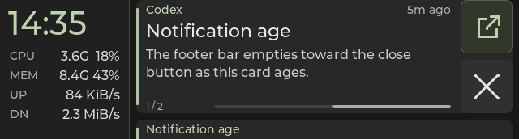

# Notification card age bar

Implemented on 2026-10-01. Native and firmware checks pass; the candidate is
flashed on Snap with normal mirroring restored. Panel feedback is pending.

The notification-history foreground card has a thin neutral footer bar
between its position counter and the right-side × control. It starts full
and empties left to right toward ×, showing the fraction of the card's
configured retention lifetime remaining. The remaining segment stays anchored
beside the close button. A five-minute-old card with ten-minute retention is
half full on the right. The existing relative-age label remains.

The track is four pixels high, normally starts at card-local x=96, and ends
at x=388, twelve pixels before the control column. Longer overflow/action
feedback moves its start right while preserving at least eighty pixels of
track. Singleton and multiple-card layouts retain the same placement.

The firmware uses the existing monotonic arrival and deadline timestamps.
Sync, viewing and reconnect preserve age; a genuine replacement resets it.
A disconnected board continues advancing the bar until local expiry.
The bar is inert to touch, uses existing neutral theme colors, and freezes
with the captured card during gestures and outgoing-card motion. Only
content binding updates the existing widget; it adds no per-frame allocation.
Older grouped/active-card layouts keep their existing footer.

These are production LVGL renders with virtual data and time:

The [capture manifest](notification-age-captures/manifest.json) also records
fresh and near-expiry frames. Five age-bar fixtures have identical pixels in
Debug and Release.

Validation includes fresh/half/near-expiry values, pixels proving left-to-right
emptying, custom retention, offline aging, inert footer taps, held replacements,
overflow/action-feedback spacing and legacy visibility. The composed
host/parser/state/LVGL history check
confirms that sync/reconnect keep progress and replacement renews it.
All eleven CTests pass in both Debug and Release. The ESP-IDF 5.5.3 build
passes; the app is 2,556,848 bytes, 464 bytes larger than the preceding committed build,
with 70% of its app partition free.

The Snap candidate reports version `d6e782b-dirty`, ELF prefix `9188da1dc`,
and application SHA-256 `792bee261deb40c492ed45b10c015e0d236093401391ffd57f5b12273e65beb4`.
Flash hashes verified; daemon IPC/readback confirm an unpaused live link,
restored history, current telemetry and negotiated Open bindings. This is
deployment evidence; physical readability/touch acceptance is separate.
Recovery images and logs are saved on Snap under
`~/.local/share/esp32-349/backups/age-bar-direction-snap-20261001T190716Z/`.
