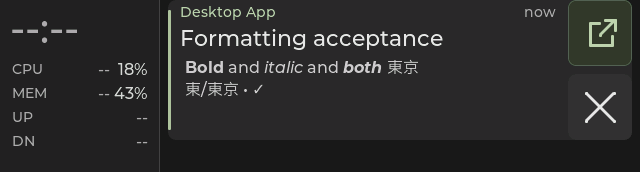
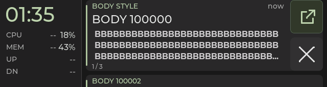

# Notification body cleanup and formatting acceptance

Accepted on Starship, 2026-09-30 local time (2026-10-01 UTC). Acceptance exercised
a worktree based on `7bef9dc`; this is a short acceptance checkpoint,
not a soak. The subsequent Snap rollout is recorded separately below.

## Delivered behavior

- Host conversion removes supported desktop markup while retaining visible
  text, decoded entities, link labels, image alternative text and line breaks.
- Identified Codex terminal messages interpret Markdown emphasis; other
  terminal messages remain literal. Kitty's plain-text guards are removed
  without treating arbitrary terminal text as HTML.
- `notification-body-style-v1` adds at most 16 validated UTF-8 byte ranges.
  Older peers receive readable plain text without the new fields. Invalid or
  excessive metadata falls back to plain text as a whole.
- Device bodies render regular, bold, italic and combined emphasis in the
  existing 16 px, three-line rectangle. CJK/symbol fallback remains regular.
  Spans are inert and reused across gesture frames; replacements, held
  gestures and atomic full sync retain coherent text and style metadata.
- Original D-Bus app/title/body remain separate for Open validation. Retention
  stays 600 seconds; formatting, viewing and sync do not renew a card.
- The source-managed `codex-notify` helper preserves available paragraphs in
  Kitty's encoded body. Ghostty's existing transport remains compact.

Design: [execution plan](notification-body-plan.md).
Protocol: [body styles v1](notification-body-protocol.md).

## Automated gates

| Gate | Result and scope |
|---|---|
| Full host suite | 257 passed initially; 258 passed at commit review, including source conversion, capability projections, raw action identity, notification history and the repeated-break regression below |
| Native Debug | 11/11 CTests passed |
| Native Release | 11/11 CTests passed |
| New composed body gate | Actual host conversion/projection through the C parser, state and LVGL spans; four styles, CJK fallback, ellipsis, replacement, atomic commit, expiry and held-input update/removal |
| Font audit | Coverage, regular fallback, matching metrics and overhang checks passed; generated styles repeated with identical hashes |
| Chezmoi helper checker | Seven checks passed, including paragraph transport, control sanitization, bounds, focus policy and tmux wrapping |
| Firmware | ESP-IDF v5.5.3 build and flash passed; flashed data hash verified |
| Final review | Both repositories passed `git diff --check` |

The composed fixtures also confirm that no span rebuild is needed on gesture
frames and that production-font ellipsis stays in the fixed body area. These
are native synthetic captures, not photographs or physical evidence:

## Starship deployment and resource boundary

Canonical checkout: `/home/bryan/code/esp32-349`. The daemon's service working
directory is its `host/` directory, and its 20:20:16 PDT restart postdates all
changed host modules. The helper was narrowly applied from chezmoi, with
source/live bytes verified equal.

| Artifact | Accepted identity |
|---|---|
| Firmware descriptor | `7bef9dc-dirty`, firmware version `0.2.0` |
| Firmware ELF SHA-256 | `b2794933e6bad32dff4732c8bdf4f90e6efa01a251d70451ba13ce22f51df95f` |
| Application binary SHA-256 | `03f26a4aadb22ca348e5e2d113cd1509e52950cfb66f93ff2e5ad7f84f5f05b3` |
| Live helper SHA-256 | `130cc78a15c8e13efed66332fde16207df52cff7b2a2d88ac91c7a529cd69a6d` |

The fresh device hello reported `b2794933e` and advertised body styles along
with history/cache/dashboard/grouped/actions capabilities. Host status
negotiated styles, and the live link and telemetry remained active.

The app grew from 2,468,848 to 2,556,384 bytes (+87,536 bytes, about 3.55%),
leaving about 70% of the 8 MiB app partition free. Target symbol measurements
show notification storage increasing from 648 to 784 bytes per card: +8,704
bytes across the 32 committed and 32 staging PSRAM slots. Three Latin style
fonts add 71,622 bytes of glyph bitmaps. Existing regular/CJK fonts are reused.

A brief live probe sent three bodies with the maximum 16 disjoint ranges,
then exercised the two formatting fixtures and real Open. Recorded minimum
free internal heap was 50,599 bytes and PSRAM 7,891,228 bytes; LVGL and link
task stack watermarks were 1,356 and 2,064 bytes. The earlier baseline minima
were 56,835 / 7,899,420 bytes and 1,356 / 3,608 bytes respectively. Card
populations and execution paths differed, so these are headroom observations,
not a controlled performance comparison or a general exhaustion guarantee.
There is no new frame-rate claim.

## Physical checks and restoration

1. Two owned persistent desktop fixtures, `Codex` and `HTML / CLEAN TEXT`,
   exercised Markdown and desktop markup, all four styles, LF, apostrophes,
   CJK, links and entities. They occupied the front of the existing deck;
   earlier real history was preserved. Real agent arrivals were temporarily
   filtered while telemetry continued. The user reported **“Formatting and
   controls look right”** after browsing and dismissing both.
2. An actual Kitty/Codex notification from the installed helper exercised Open
   with a multiline emphasized body. Only this owned test bypassed focus
   suppression and requested a persistent popup. The user reported **“Correct
   terminal opens; card closes.”** Fresh compositor samples recorded another
   window (`46`) followed by the expected terminal (`32`), and device readback
   showed the ready local card `100015` removed. Raw action-result envelopes
   are not exposed by the existing readback API.
3. All five owned desktop fixtures were closed with no cleanup errors; the
   owned Kitty identifier was closed too. Temporary config lines were removed,
   and the live config was verified byte-equal to its backup. Normal mirroring
   is restored, daemon pause is false, and the device link is live.

Raw deployment, source-hash, resource and physical readback evidence and the
previous firmware/helper/config recovery copies are kept locally under:
`~/.local/share/esp32-349/backups/body-formatting-20261001T031851Z/`.

## Remaining limits

- Three visible body lines and the 511-byte bound still truncate long content.
  There is no body-text scrolling, interactive link or special inline-code font.
- CJK/symbols outside the Latin style set use their existing regular glyphs;
  unavailable emoji continue to show placeholders.
- Ghostty cannot recover paragraphs already flattened by its producer path.
- Desktop markup was exercised by owned D-Bus fixtures, not by creating a
  real Chrome website notification. Kitty's transport and native focus action
  were exercised through the actual installed helper and originating terminal.
- No new suspend, long-duration soak or exhaustive heap-exhaustion testing
  was performed. Snap's rollout below has a separate verification scope.

## Snap rollout — 2026-10-01

The user requested flashing while physically at Snap. The board's USB identity
ends in `28:84:85:92:C4:3C-if00`. Both checkout HEADs were `7bef9dc`;
Snap's existing 10-minute retention work was preserved. All 44 changed/new
project files were synchronized and verified against Starship's source hashes.
Only the two Codex helper/checker files were synchronized in chezmoi; the helper
was narrowly applied and source/live bytes match the hash above.

The exact Starship application, bootloader and partition images were transferred
and flashed from an archived candidate directory. Snap's application and ELF
hashes match the accepted identities above; the flash verified written data.
The existing Snap build directory was retained, rather than represented as a
fresh local build. Its previous firmware ELF `26973a571` matches the saved
baseline and the daemon's earlier hello.

The new daemon restart loaded the canonical host checkout. A fresh device hello
reported `b2794933e`; host status confirmed a live, unpaused link and negotiated
body styles, notification history and actions. Snap's focused host conversion
and projection tests passed 28/28, and the helper checker passed all seven
checks. Both synchronized repositories passed `git diff --check`.

The owned `SNAP FORMAT CHECK` D-Bus fixture exercises regular/bold/italic/combined
text, three clean lines and CJK. The user reported **“Looks right; dismissed”**
after checking typography, line breaks, CJK and the updating rail, then tapping
×. Device readback confirmed its local card `100002` was removed; the owned
desktop fixture was subsequently closed with no cleanup errors. No real Snap
Open action or gesture-race acceptance is claimed by this deployment.
The daemon's ordinary notification feed and telemetry remain enabled, and no
notification configuration change was made.

Recovery copies, the source manifest, flash log and readbacks are on Snap under
`~/.local/share/esp32-349/backups/body-formatting-snap-20261001T163556Z/`.
The first esptool invocation rejected hyphenated command/reset names before
touching the board; the retry used Snap's installed underscore spellings and
completed successfully. This rollout preceded the commits recorded below.

## Commit review follow-up — 2026-10-01

The review found that consecutive HTML ` ` / ` ` tags collapsed an
intentional blank line. Each explicit break now contributes LF before normal
blank-line normalization; the new regression covers two and four breaks and
checks the subsequent CJK style byte offsets. The full host suite passed
258/258, native Debug and Release each passed 11/11, and the font audit and
seven helper checks passed. This is a host-only correction; firmware code and
the accepted application binary are unchanged.

Implementation commits are separated by responsibility:

- `61b48b3`: reduce default notification history to ten minutes.
- `7f64b70`: host source conversion and capability-gated style metadata.
- `3721475`: device span rendering, pinned fonts and composed/native checks.
- Chezmoi `9bf4725`: retain Kitty notification paragraphs.

The upstream OFL file retains its SHA-256-pinned bytes. A narrow Git whitespace
attribute applies only to that license because the original contains a trailing
space; all authored source remains subject to the normal whitespace check.
