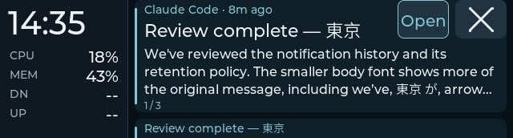
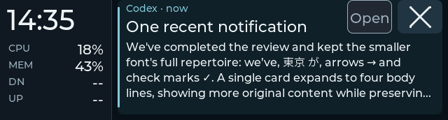
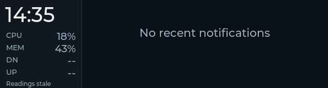

# Notification-only history checkpoint

2026-09-28, Starship. Implementation, automated gates, deployment,
expanded-cache board readback and the observer's brief visual/touch check pass
on `b9be56530`. Normal mirroring is restored with the original config unchanged.
The later [button refinement](button-controls-refinement.md) records the
Open icon, touch policy and fixed card height separately; captures below are
from this history checkpoint's original controls and taller singleton.
The board had disappeared while the host slept; the user reported the host
awake, and USB/link inspection confirmed its return before flashing.

## Implemented behavior

See [the implementation plan](notification-history-plan.md). Capable peers use
the fixed telemetry rail and a notification-only right pane; horizontal app
navigation is parked. Empty means `No recent notifications`. Vertical whole-card
navigation, body-tap inertness, explicit Open/× controls and lifecycle motion
remain. Titles are 22 px; bodies are 16 px with three lines plus a peek, or four
for a singleton. App metadata includes relative age.

At this checkpoint, default retention was 1,800 seconds from genuine arrival
or replacement, bounded to 32 records in daemon RAM. Popup timeout retains text; viewing, full sync and
reconnect do not renew it. Explicit close/dismiss removes it. The device also
expires cached records offline. A higher history revision renews a record;
same/older revisions cannot extend a deadline or undo an expired revision.
Manual browsing preserves focus, including against critical arrivals; 30 seconds
without interaction makes later arrivals eligible again. Emptying the collection
also releases manual focus suppression. Open requires a valid live action and
unexpired history. New peers get 511-byte UTF-8 bodies; legacy peers keep 159.

## Retention refinement, 2026-09-30

The current default is **600 seconds (10 minutes)** from genuine arrival or
replacement. Desktop popup duration remains independent. Reloading a shorter
limit preserves receipt times, removes already-old records and sends the
remaining lifetime to the board; browsing/sync/reconnect still do not renew it.

Focused configuration, state, history and reload tests pass: **62 tests**.
The native `host_history_composed` and `smoke_recorder` checks also pass with
the new default. Virtual time covers offline expiry, reconnect and replacement
renewal; the reload regression checks that existing cards keep their age.

Both hosts' unmanaged `349d` configs now explicitly set `retention_s = 600`,
and both reloads succeeded without restarting the daemons. Snap's live host
and board counts agree, with the notification pane settled and no stale view.
Starship's board is disconnected; its host configuration is updated, with no
device claim. No firmware change or additional physical check was needed.

## Automated evidence

| Gate | Result and boundary |
|---|---|
| Final host suite | 204 passed, 3 skipped in 12.83 s. Session-bus integration was deliberately excluded with `env -u DBUS_SESSION_BUS_ADDRESS`; deterministic source/action coverage still ran. |
| Native Debug / Release | 10/10 CTests each. Production parser/state, LVGL widgets/fonts, virtual time/pointer input and composed Python host scenarios. No ESP32 scheduling, panel or physical touch claim. |
| History composition | Real, unfiltered firmware hello negotiation; empty pane, long UTF-8 text, popup timeout retention, vertical navigation/inert horizontal input, 30 s idle handoff, archived Open unavailability, animated × removal, sync/reconnect age preservation, replacement renewal and local expiry. Destination and last-card expiry while held cancel safely. |
| Compatibility | Existing grouped and action scenarios remove only the history capability from the actual hello, preserving their Home/grouped checks. Parser verifies old-mode body limits. |
| Expiry regressions | Same-revision sync cannot restart time; offline expiry blocks stale notify/sync; older replay cannot lower an expired-revision tombstone. Expired presentation state and exact-deadline Open eligibility are checked. |
| Readback publication | Switching into history cannot report the prior Home view as settled. A board probe exposed this race; a native parser/serializer regression and final board rerun pass. |
| Rendered captures | 89 current-suite PPM frames match byte-for-byte between Debug/Release, including 67 grouped/history frames. All eight committed telemetry-rail captures retain identical pixels. |
| Font coverage | 2,602 glyphs at 16/20/22 px, exactly matching the existing repertoire. Font16 line height 22 px, bitmap 232,118 B; final target map attributes 256,227 B of read-only data to it. Glyph presence is distinct from physical legibility. |
| ESP-IDF | IDF 5.5.3 build passed. Binary 2,466,256 B in an 8 MiB app partition, with 71% free. Recorded 4,952 local firmware input hashes match before/after the final build. |
| Starship serial probe | Eight real host samples at approximately one-second intervals, 32 cached 511-byte bodies, 10 numeric readback stress cases, controlled 3 s expiry without a host close, same-revision non-renewal, expired replay suppression and higher-revision renewal pass. This probe supplies its own cadence. |
| Short resource sample | Minimum-free link/LVGL stack: 2,120 / 3,116 B. Minimum internal/PSRAM heap: 47,675 / 7,899,420 B in the controlled full-cache run. No long-duration or new rendering-performance claim. |
| Physical follow-up | The user confirmed readable cards, restored DN/UP traffic, clean dismissal and the notification-only empty state. Serial evidence separately records browsing and normal-service restoration. |
| Diff hygiene | `git diff --check` passed on the rollout candidate. |

Final commands:

```sh
env -u DBUS_SESSION_BUS_ADDRESS uv run --project projects/349-status/host \
  --frozen pytest -q projects/349-status/host/tests
python3 projects/349-status/tools/check_native_ui.py \
  --cjson-include /home/bryan/.espressif/v5.5.3/esp-idf/components/json/cJSON
python3 projects/349-status/tools/check_font_coverage.py
```

Luna implemented host lifecycle/projections and the font/composed-test slices.
The primary owned the wire contract, firmware state/UI integration, expiry and
focus review fixes, final integrated gates, captures and rollout preparation.

## Reviewed native captures

These are 640 × 172 production-font renders with virtual data, not board photos.
The [manifest](notification-history-captures/manifest.json) records their hashes.

Multiple cards:



Singleton with four body lines:



Empty after offline expiry (the stale rail footer is intentional in this fixture):



Additional captures cover unavailable Open, disconnected browsing and actual
75 ms arrival/removal motion frames. Rendering architecture and performance
tuning are unchanged by this checkpoint.

## Candidate and recovery provenance

| Item | Identity |
|---|---|
| Source base at rollout | `9f8c44c`, main, with the reviewed history changes in the worktree |
| Running app version / ELF prefix | `9f8c44c-dirty` / `b9be56530` |
| Binary SHA-256 | `bbbfa7de605cd075e34a4c17e8f775d378cbdfc9bfbef2154ec304fe33004948` |
| ELF SHA-256 | `b9be56530eed2038a81caeb6cc1e615c04bb51358a68597e4fa36850ae1839ef` |
| Previous accepted board build | `4c9005831`; source/deployment record is in [rail acceptance](telemetry-rail-acceptance.md) |
| Unmanaged config SHA-256 | `be206c36381a4a48352610aeab05627b97b507fd05399e7447bc758257ded398` |

Evidence and recovery directory:

```text
~/.local/share/esp32/backups/notification-history-starship-20260929T022230Z
```

It contains the exact prior accepted image, previous HEAD host archive,
original config, candidate artifacts/hashes, final build/input witnesses,
host/native logs, native traces/captures and parity results. The original config
is unchanged. Both flashes verified the image hash. The initial `bf2728c91`
probe and its transient Home/readback failure remain archived; the final
`b9be56530` probe passes. The normal service was restarted to load the reviewed
host code at 20:01:12 PDT, with systemd main PID `421893` (`uv`) and Python PID
`421896`, and negotiated history/Open successfully before the isolated check.
Its RAM history starts fresh at daemon restart, as designed. The unit runs
`uv run --frozen 349d` from this checkout's `projects/349-status/host` directory.

## Physical check and restoration

The isolated `run_grouped_smoke.py --history` recorder seeded three long-lived
cards in session `45539866`, preserving the paused normal daemon's RAM
collection. The user reported "cards reads fine, but dn/up on the left stayed
empty?" The fixture intentionally supplied CPU/MEM but omitted traffic rates;
serial readback confirmed both rates were null. This observation concerned the
fixture, not the live host feed. The trace records fourteen browse events,
positions 1/2/3, and the subsequent 30-second idle handoff.

The recorder finished without a controller error, cleared its synthetic state
and restored normal session `45539865`. Readback matched the normal daemon's
five retained records, with a live link, history/Open negotiated, no stale view,
no pending action and numeric DN/UP rates. Fixture and normal notification IDs
can overlap; the session identity distinguishes them.

With the live feed restored, the user confirmed "Traffic and dismissal/empty
state look right" in response to checking DN/UP, clean × removal and the final
`No recent notifications` state without a large clock. Physical readability and
removal are therefore accepted; detailed input/expiry race coverage comes from
the automated scenarios above. No desktop-action focus recheck was required by
this layout/retention checkpoint.

Forty-one normal IPC/readback observations include an empty host and device
collection, followed by a new real retained card. The right pane stayed
`notifications`, traffic remained numeric and the view was not stale. This
witnesses empty-state agreement and continuing normal mirroring after dismissal;
it is not a raw touch-event trace.

`physical/result.json`, `physical/trace.jsonl`, `physical-acceptance.json` and
`closure.json` in the recovery directory keep observer answers, fixture serial
evidence, normal-service restoration and final source/artifact/config witnesses
separate. Post-restoration normal-service diagnostics reached 1,836 B minimum
free LVGL stack; the controlled cache probe's 3,116 B figure above describes a
different short run. The link minimum remained 2,120 B.

No Snap rollout, new rendering performance claim, long-duration stability,
disk persistence, clear-all or additional apps are part of this checkpoint.
