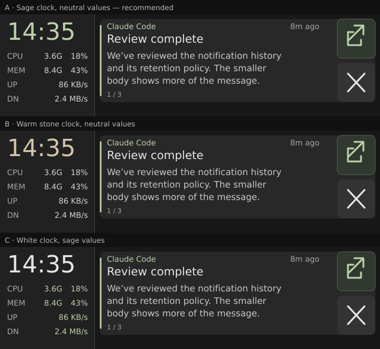
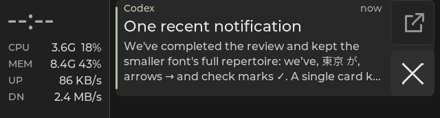

# Rail clock accent design pass

Status: option A implemented and flashed on Snap; native and firmware checks
passed; Snap panel acceptance passed on 2026-09-30. The
[at-size comparison](rail-clock-accent-options.svg) uses vector approximations
of the 640 × 172 screen, not RGB565 firmware captures or board photographs.
The later [number/unit trial](rail-number-unit-pass.md) has been reverted to
this uniform-value palette. That pass also records the traffic spacing and
binary-unit correction, with separate deployment evidence. The evidence below
describes the initial accepted uniform-value baseline.

## What the panel checks established

- A different color for CPU frequency/memory amount than their adjacent
  percentages made each row look inconsistent.
- Four muted row accents made the narrow rail busy; the first lavender also
  sat too close to the gray `MEM` label.
- Uniform white values were calmer. Moving them to `#D0D0D0`, then to
  `#C0C0C0`, did not create enough perceived separation from the bright clock
  on the panel without pushing the labels toward being too dim.

The rail has one large, stable element above four compact readings. Tinting
that single clock should create a clearer boundary while keeping the stats
as a neutral block. The notification card retains the screen's main content
priority.

## Options

| Option | Clock | Live stat values | Labels | Assessment |
|---|---|---|---|---|
| **A. Sage clock** | `#BBD1AB` | `#D4D4D4` | `#A8A8A8` | Reuses the existing sender/Open sage; one accented element in the rail. Recommended first panel trial. |
| B. Warm stone clock | `#D4C4AA` | `#D4D4D4` | `#A8A8A8` | Separates time from the sage action family, but adds a hue near the existing amber warning role. |
| C. Sage values | `#E6E6E6` | `#BBD1AB` | `#A8A8A8` | Keeps the clock neutral, but colors six small values and pulls more attention into the rail. |

The right-side card is identical across all three studies. Its sender, title,
body, age, Open, Close, and critical colors retain their current roles.
All three studies retain the existing geometry and text sizes. The colors in
option A have approximate sRGB contrast of 9.8:1 for the clock, 10.9:1 for
values, and 6.8:1 for labels against the `#212121` rail. These numbers do not
predict perceived contrast on the ESP32 panel.

## Recommendation and implementation boundary

Option **A** is the accepted implementation on Snap. The clock reuses a hue already present in normal
notifications, while the values remain readable and neutral. The large clock
is spatially separate from the card action, so the repeated sage should read
as a shared accent rather than a second button. B is the fallback if a sage
clock feels too green or makes Open less distinct. C is a useful comparison
but is least aligned with the goal of keeping attention on notifications.

The implementation changes the rail clock, live-value, and label roles.
Invalid/stale values stay secondary gray. An unavailable `--:--` clock dims
instead of taking the accent; its return to a valid time restores sage. The
native grouped UI fixture covers that recovery and renders the current
notification-history layout through RGB565. The brief Snap panel check
confirmed clock separation, readable neutral stats, and card hierarchy.

## Implementation evidence

On 2026-09-30, native Debug and Release each passed 10/10 CTests, including
the host-composed notification, action, and history cases. The updated clock
fixture also passed in both configurations. Nine
[actual-size native captures](color-hierarchy-captures/manifest.json) were
refreshed and reviewed; these are synthetic LVGL output, not panel photos.

Snap's checkout has byte-identical source files to the reviewed local tree.
The ESP-IDF v5.5.3 build produced app binary SHA-256
`8f9498f5af0ea42177e9be800ab260a1dac46c63b042efe6d664f6c138a3a078`
and ELF SHA-256
`6d4c7ad3c6636018b7e123d8bbe6266c5ca512c0fc29c5be59637986505c0bc4`.
The previous Snap source and firmware were backed up under
`~/.local/share/esp32-349/backups/clock-accent-snap-20260930T163649Z`.

The board (`28:84:85:92:c4:3c`) was flashed under `349ctl pause`/`resume`
ownership. Flash hashes verified, and the boot log reported the matching ELF
prefix `6d4c7ad3c`, successful display startup, and a card sync. Fresh host
status showed a live link and current one-second dashboard traffic. A local
`COLOR CHECK` card was sent for panel review. These readbacks establish
deployment and delivery.

## Snap panel acceptance

On 2026-09-30, the user confirmed that the sage clock feels distinct from
the neutral CPU/MEM/UP/DN values, with readable gray labels and card text,
and reported dismissing the test card using ×. A subsequent board readback
contained no cards, no overflow, no pending action, and a non-stale deck;
test ID `100085` was absent and dashboard readings were current. The accepted
palette is the source and firmware identified above. Starship's source is
synced, while its board still runs the earlier grayscale trial.
