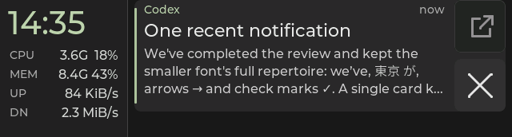

# Rail values and traffic units

Status: uniform neutral readings restored and flashed on Snap; native and
firmware checks passed; Snap panel acceptance passed on 2026-09-30. This follows the
[accepted sage-clock palette](rail-clock-accent-pass.md).

## Final treatment

| Element | Color |
|---|---|
| Clock | Existing sage `#BBD1AB` |
| Complete live readings, including units | Neutral `#D4D4D4` |
| CPU/MEM/UP/DN labels and invalid/stale readings | Existing gray `#A8A8A8` |

The number/unit color split is reverted at the user's request. The trial used
neutral numbers with muted stone `#B8B0A2` suffixes, but the distinction added
little scanning value to the small readings. One color treats each reading as
a whole. The sage clock provides the main separation within the rail.

The font sizes, row positions, column widths, and right alignment remain
fixed. CPU/MEM keep compact suffixes (`1.9G`, `5%`, `8.4G`); traffic has a
space before its full unit (`100 KiB/s`). Snap panel feedback rejected the
trial that removed the traffic gap. CPU frequency continues to use `G`
below 1 GHz. The existing smaller font at `100%` fits the reserved column.

## Traffic arithmetic

Network rates use binary multiples of 1,024, matching the user's expected
convention. Their explicit labels are `B/s`, `KiB/s`, `MiB/s`, and `GiB/s`.
The prior formatter divided by 1,000, even when its label was `KB/s`.
The compact-spacing trial only changed text and capitalization; binary
scaling was the subsequent correction. See the
[binary/decimal byte definitions](https://physics.nist.gov/cuu/Units/binary.html).

The host reads physical-uplink byte counters, computes their differences over
elapsed monotonic seconds (a window of at least two seconds), and sends raw
bytes/s. Firmware divides by 1,024 for each displayed unit step. For example,
204,800 bytes transferred over two seconds is 102,400 B/s, displayed as
`100 KiB/s`. A rate of 1,048,576 B/s displays as `1.0 MiB/s`. Rounding can
promote to the next unit at a boundary. Memory already uses binary scaling.

## Rendering and validation

Each reading is a plain, cached LVGL label. The unit color token and inline
recoloring machinery are removed. Invalid readings show gray `--`; stale
readings keep their text in uniform gray. Fresh data restores the whole
reading to neutral.

On 2026-09-30, the uniform-value reversion passed all 10 Debug and all 10
Release CTests and the ESP-IDF v5.5.3 firmware build. The rail fixture
checks exact binary conversions, rounded unit transitions, fixed geometry at
`1%`, `99%`, and `100%`, unavailable readings, and stale-state recovery.

Five [native captures](rail-number-unit-captures/manifest.json) include the
current notification-history screen and its empty state. The `100%`,
unavailable, and stale cases use the grouped diagnostic fixture to isolate
rail states; its large Home clock is not the notification-history layout.
These are production LVGL output converted from PPM to PNG without recoloring,
not photographs of the panel.

## Snap deployment and panel review

Snap's app binary SHA-256 is
`11ba74b6da1a80243b2bac1f59c938cc7b39ec7f5fffe10e137f2256925f053b`,
with ELF SHA-256
`26973a571f38c97ea05278d605c59da55c3a4baed2f35c6d90493e119a350e99`.
The deployed source matches code commit `265c731` and the reviewed Starship
checkout byte for byte. Firmware was built before these commits, so its
reported version remains `b897589-dirty`; the ELF hash above identifies that
accepted image. The board
(`28:84:85:92:c4:3c`) was flashed under `349ctl pause`/`resume` ownership, with
flash hashes verified. Its boot log reports ELF prefix `26973a571`, successful
display startup, and the restored host link. Fresh device readings are
current and the deck is non-stale. After this deployment, the user confirmed
that the screen looks good and requested review and commit. This accepts the
uniform-value treatment and the spaced binary traffic units on Snap.

The prior split-color source and firmware are backed up on Snap at
`~/.local/share/esp32-349/backups/rail-uniform-values-20260930T201744Z`.

The normal feed is sufficient for visual review; no test notification or
touch sequence is needed. Starship's source is synced, but its board remains
on the earlier grayscale build.
