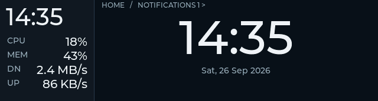
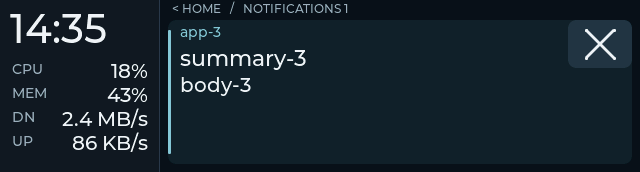

# Telemetry rail acceptance

Accepted on Starship on 2026-09-28, after an initial Snap rollout and a source
review follow-up. Starship's resumed USB check exposed a link-stack overflow;
the corrected build passes readback and the brief physical readability check.
Snap remains on the earlier candidate. The
[plan](telemetry-rail-plan.md) defines the checkpoint.

## Behavior

- Local HH:MM remains above fixed CPU/MEM/DN/UP rows in Home and Notifications.
  HOST and BAT no longer occupy the rail.
- Download/upload are receive/transmit bytes on unique active physical
  default-route interfaces, deduplicated across IPv4/IPv6. Snap's Ethernet and
  Wi-Fi both qualify. Virtual interfaces are excluded from the total.
- The default one-second sample deadline is independent of notification/action
  wakeups and full sync. Full sync reuses the latest sample after startup.
  Delayed ticks sample once rather than catching up in a burst.
- CPU keeps its three-second EMA. Rates use actual monotonic counter deltas
  over at least two seconds, refreshed each second. Counter resets, interface
  changes and unreadable counters discard the baseline; `--` is unavailable
  and `0 B/s` is a valid measured zero.
- Decimal units remain within the production-font value column, including
  rounding across units and the bounded `>999GB/s` representation. Clock
  evaluation runs once per second; HH:MM changes visibly each minute.

The configurable `daemon.tick_s` remains compatible; its default and Snap's
loaded setting are 1.0. Gestures, Open/×, lifecycle motion, rendering and font
assets keep their existing behavior.

## Initial candidate automated gates

| Gate | Result |
|---|---|
| Focused host source/dashboard/protocol/state/cache | 71 passed |
| Integrated host suite without a desktop bus | 177 passed, 3 desktop integration tests skipped |
| Native production LVGL/protocol/composed suite | 9/9 Debug and 9/9 Release |
| Strict standalone dashboard parser | Passed nullable, bounded and invalid-rate cases |
| Previous unmodified dashboard parser | Accepted the added RX/TX fields and preserved old readings |
| ESP-IDF 5.5.3 firmware build | Passed; app 2,206,688 bytes, 74% of app partition free |
| Build input witness | 4,942 project/managed-component input hashes unchanged across the build |
| Native pixel comparison | All 60 grouped frames identical between Debug and Release |

Deterministic host fixtures cover dual-stack deduplication, multiple physical
uplinks, virtual exclusion, warmup, valid zero, counter reset, interface change,
unreadable/malformed counters and delayed sampling. Scheduler checks include
startup sync, several early event wakeups, full sync and a delayed tick without
extra samples. Existing integrated tests cover notification/group/action paths.

Native checks use production fonts to assert fixed row positions and text
widths, clock evaluation cadence and unavailable/offline/stale behavior.
The [capture manifest](telemetry-rail-captures/manifest.json) records eight
native 640 × 172 captures. They are controlled LVGL output, not photographs:





## Source review follow-up

On 2026-09-28, while the user was away from both boards, a code review reproduced
and fixed three host failures:

- A source taking longer than one tick left the sampling deadline overdue and
  caused an immediate second refresh. Sampling now schedules from completion.
- A queued full sync could combine new bar zones with the previous dashboard.
  Sampling, cache publication and dashboard/zones updates now share one state
  lock, including the tick's presentation handling.
- Non-ASCII route, operstate or carrier data raised a decoding exception out of
  the sampler. These reads now report unavailable traffic, discard the baseline
  and recover after valid data returns.

The refactor also removes duplicated scheduler setup, counter-history copying
and an unreachable elapsed-time branch. Shared finite-number validation and a
dedicated dashboard readback parser preserve the distinction between sanitized
outgoing values and strictly validated device responses.

Seven added regression cases cover slow collection, queued sync, all four text
read failures and interval changes without sync-triggered sampling. Existing
protocol cases also exercise integer-to-float overflow. The integrated host
suite passes **184 tests**, with **3 desktop integration tests skipped** in
headless mode; the native suite passes **9/9 Debug and 9/9 Release**. There are
no further firmware changes in that source-only review.

These host fixes were subsequently deployed on Starship during the resumed
loop below. Snap's recorded firmware and preview
remain the earlier candidate; the user declined Carbon viewer setup.

## Snap rollout and real telemetry

| Item | Evidence |
|---|---|
| Reviewed source base | `ac5cac9`, with uncommitted rail implementation |
| Live firmware | `hello.build=ac5cac9-dirty`, `hello.build_sha=9c1e6a770` |
| Binary SHA-256 | `ddae94cf625a978082fed2ec8888007e43d453f53465a0526506036fdb75b5e2` |
| ELF SHA-256 | `9c1e6a770dc60e1ad01befd1b8c2126715a88fd59744edceaa02ea77787402d7` |
| Board USB identity | `28:84:85:92:C4:3C` |
| Service restart | 2026-09-28 16:10:52 PDT; main PID 749060, Python PID 749070 |

The reviewed candidate was staged separately from Snap's dirty clone:

```text
~/.local/share/esp32/previews/telemetry-rail-20260928T223911Z
```

All 182 staged files initially matched the candidate manifest. Firmware was
flashed under sticky pause and esptool verified written hashes. The service
drop-in now selects the preview's host directory; restart starts fresh RAM
notification history. The unmanaged config was preserved byte for byte,
including the one-second cadence and existing ten-second normal presentation.
The unchanged DMS action plugin still points at the preceding preview; its
files match this candidate's provider source, and live negotiation remains
available. Snap's original dirty checkout is preserved.

The [board probe](../tools/check_telemetry_board.py) sampled actual host CPU,
memory and physical-interface counters, serialized the production dashboard,
and compared all five fields with parsed firmware readback over USB. Eight
samples passed; intervals were 0.99984–1.00019 seconds. The board reported the
expected build and a settled, nonstale Home view. The first probe queried before
LVGL's initial publication; the probe now waits for an enabled deck before
evaluating its view.

This probe supplies its own cadence. The deterministic scheduler test proves
deadline behavior; the separate live daemon status record observes its normal
updates. With 200 ms polling, four consecutive dashboard change intervals were
observed at 1.004–1.006 seconds; this is a short status observation, not a precise
USB or drawing-timing measurement. Neither readback nor native captures alone establishes display
readability, touch behavior or performance.

Backup/evidence directories on Starship and Snap:

```text
~/.local/share/esp32/backups/telemetry-rail-20260928T223911Z
```

They retain prior images, source manifests, candidate hashes, build/test logs,
flash log, serial transcript and paired real telemetry samples. Previous
firmware `0b7587bca` and the old service drop-in are available for recovery.

## Starship resume, stack fix and acceptance

The user returned to Starship and resumed the remaining deployment/acceptance
there. The existing candidate first matched all 4,942 recorded firmware input
hashes and all five build artifacts, so it was reused. Its initial Starship
probe passed four real samples, then failed with a recorded **stack overflow in
task `link`** while returning `cards_status`. The original trace and failing
image are retained alongside the correction.

The link task executes parsing and cJSON readback on its receive stack. The
old ELF has a 288-byte `link_task` frame and an 832-byte `send_cards_status`
frame before their library call chains. Its corrupted backtrace identifies
the stack overflow but does not establish one function as the sole cause.
The correction increases that task's budget from **4 KiB to 6 KiB** and adds
its minimum-free watermark to the existing ten-second health log. Protocol
fields, rate precision, UI geometry and rendering are unchanged by this fix.

| Item | Evidence |
|---|---|
| Accepted firmware | `hello.build=ac5cac9-dirty`, `hello.build_sha=4c9005831` |
| Binary SHA-256 | `81c53667b5176e549c83727a3fe09869aa9b85026acf11e4ee78fcae1d6ae3d7` |
| ELF SHA-256 | `4c9005831f7761445f8d85e97a974ee954d9120487e5461eb320aa59d2d65b44` |
| ESP-IDF build | Passed; 2,206,784-byte app, 74% of app partition free |
| Build input witness | All 4,942 input hashes unchanged during the correction build; only `main/link.c` and `main/main.c` changed from the earlier firmware |
| Flash | Application at `0x10000`, esptool data hash verified; existing bootloader/partition images match and were preserved |
| Board USB identity | `28:84:85:92:C2:20` |
| Final normal service | Restarted 2026-09-28 18:12:27 PDT, main PID 293982, working directory is the current checkout's host directory |

The extended [board probe](../tools/check_telemetry_board.py), with
`--stress-readback`, passes eight actual Starship sample/readback pairs and ten
controlled numeric cases with a full 32-card/action-readback cache. The cases
include the previously failing rate pair, fractional/exponential values, wide
rates, the upper bound and unavailable readings. The post-stress health log
reports **2,124 bytes minimum-free link stack**, above the probe's 1 KiB gate;
there was no reset or overflow. These controlled cases exercise protocol and
stack behavior, not physical network speed or UI performance.

The real probe's seven sample intervals are 0.999997–1.000004 seconds; its
cadence is provided by the probe. Separately, 45 live daemon/firmware readback
pairs match, with observed dashboard change intervals of 1.0047–1.0055 seconds
at a 200 ms polling resolution. This confirms the running daemon publishes
coherent data at approximately the configured cadence without claiming exact
USB or drawing timing.

Desktop mirroring was temporarily disabled for one persistent, owned
`RAIL CHECK` card. The user inspected Home and Notifications for about 15
seconds and replied **“Looks right; readings update”**: correct HH:MM, fixed
CPU/MEM/DN/UP rows, readable values, no HOST/BAT, clipping or stale overlay,
and approximately one-second updates when values change.

The original Starship configuration was restored byte for byte (SHA-256
`be206c36381a4a48352610aeab05627b97b507fd05399e7447bc758257ded398`). Normal
mirroring is active again with the one-second tick and ten-second normal
fallback. The owned test card is cleared; final readback is nonstale Home,
zero cached cards, live link, unpaused, with the Open provider available and
actions negotiated. This is restoration/negotiation evidence, not a fresh
application-focus usability trial.

Starship backup/evidence directory:

```text
~/.local/share/esp32/backups/telemetry-rail-starship-20260929T005510Z
```

It retains the original config, committed host rollback archive, earlier and
corrected images, source/input manifests, build/flash logs, the failing and
passing serial traces, stress records, live cadence and physical/final-state
records. Snap's preview and original dirty clone were preserved; this resumed
physical acceptance applies to Starship's corrected build.

## Closure

Starship's rail checkpoint is accepted. The owned earlier RAIL CHECK
notification was left on Snap during its initial rollout. A bounded SSH cleanup
check found DMS active but no IPC notification-identity query; current desktop
ID 117 could not be confirmed as the owned test, so it was left untouched.
Its cleanup is unconfirmed. There was no Snap service/config/firmware change
or serial query in this resumed loop.

This is a rail refinement checkpoint, not a claim of long-duration stability,
new renderer performance, or additional application action/focus coverage.
Snap still needs the corrected firmware/host follow-up before matching this
accepted Starship installation.

## Source checkpoint

The reviewed changes are split into these commits, followed by the accompanying
design/acceptance documentation:

- `2c6e739`: fixed telemetry rail, traffic sampling, coherent cadence and tests.
- `df434eb`: link-stack correction, health watermark and board regression probe.

The final source review reran the headless host suite: **184 passed, 3 desktop
integration tests skipped**. Native checks passed **9/9 Debug and 9/9 Release**;
all 60 grouped frames matched between configurations, and all eight documented
captures matched the fresh native output and their recorded hashes.

The accepted Starship image was built from `ac5cac9-dirty` before this source
checkpoint; its binary and ELF hashes above identify the tested artifact.
Committing the source does not rebuild or reflash the board. Snap's deployment
follow-up remains separate.
