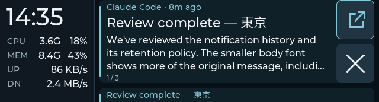

# Rail details refinement

Implementation follow-up, 2026-09-29. The earlier
[rail plan](telemetry-rail-plan.md) and [acceptance record](telemetry-rail-acceptance.md)
describe the preceding percentage-only CPU/MEM and DN/UP layout.

## Layout

Keep the 160 px left rail, local HH:MM, four fixed row baselines and footer.
The row order is CPU, MEM, UP, DN. Example readings:

```text
CPU  3.6G      18%
MEM  8.4G      43%
UP        86 KB/s
DN       2.4 MB/s
```

Labels begin at x=12. CPU/MEM detail widgets begin at x=52 and occupy 50 px,
right aligned through x=102 so their unit letters stay fixed.
Percentages occupy a separate 42 px column at x=106, right aligned through
x=148, separated from details by 4 px. The generated font's `100%` measures
exactly 42 px; `1%`, `99%`, `100%` and `--` cannot shift the detail widgets. Traffic
occupies x=52 through x=148. All values use the existing 16 px font, giving
traffic and CPU/MEM equal visual weight. Names use the existing metadata font.
The same geometry applies to recent-notification history and legacy dashboard
views, including empty, stale and disconnected states.



## Readings and units

- CPU frequency is the mean of the current `cpu MHz` entries in `/proc/cpuinfo`,
  rounded to 0.1 MHz on the host. It is neither the nominal model frequency nor
  a claim that every core has the same clock. Compact `M`/`G` mean MHz/GHz.
- CPU usage keeps its existing three-second EMA and integer percentage.
- Used memory is `MemTotal - MemAvailable` from one `/proc/meminfo` read.
  Its percentage divides that exact amount by `MemTotal`; readily reclaimable
  memory is accounted for through `MemAvailable`.
- Memory `B`/`K`/`M`/`G`/`T`/`P` use binary multiples of 1024. Scaled amounts
  below 100 have one decimal; larger amounts have no decimal. Values promote
  to the next unit when rounding would otherwise require four integer digits.
- UP is transmit and DN is receive. Their existing physical-uplink scope,
  decimal units, zero/unavailable distinction and two-second counter window
  remain. Sampling and clock polling retain the one-second cadence.

Missing or invalid detail readings show `--`; valid CPU/MEM percentages stay
visible. A measured zero is distinct from unavailable. Stale data retains its
last text in the existing muted color with the existing stale footer.

## Optional wire fields

`dashboard-v1` adds two nullable fields to dashboard deltas and atomic sync:

| Field | Unit | Accepted finite range |
|---|---|---|
| `cpu_freq_mhz` | MHz | 0 through 100,000 |
| `mem_used_bytes` | Whole bytes | 0 through 2^50 (1 PiB) |

The memory bound is exactly representable by cJSON's double representation;
bytes must be integral. Booleans, strings, nonfinite and out-of-range values
are unavailable in sanitized host payloads and reject malformed firmware
updates. Older firmware ignores unknown fields. Older hosts leave details
unavailable; older device readback may omit these fields. New firmware returns
them, including null, in `cards_status`. Sync-size validation includes their
maximum wire values.

## Validation

- Host tests: 228 passed, including real session-bus tests. New fixtures check
  average current frequency, paired memory sampling, unavailable readings,
  optional backward-compatible readback, bounds and full-sync coherence.
- Native LVGL/composed protocol suites: 10/10 in Debug and 10/10 in Release.
  Checks measure text with the actual 16 px font, keep the same widget positions
  across `1%`/`99%`/`100%`, exercise unit rounding and verify UP/DN binding.
- Standalone firmware dashboard parser: warnings-as-errors build and checks pass,
  including nullable details, integral memory and numeric bounds.
- ESP-IDF firmware build passes. Native captures are synthetic UI evidence;
  device USB readback and physical readability are separate gates below.

## Starship deployment

The refined firmware is running on Starship's attached board:

| Artifact | Value |
|---|---|
| Source base at build | `0135fea`, plus this rail details refinement |
| Firmware hello / ELF SHA prefix | `8987b3aa3` |
| ELF SHA256 | `8987b3aa3bd91d1a651f45650195d39868c69b64e6d38cf4ed2ec647c9c50662` |
| Firmware binary SHA256 | `afc8c652ea50807dd5f81e75c11b7436b85f732cb9ab84227ff2e2170c80547d` |
| Binary size | 2,468,432 bytes |

The previous accepted image and config were backed up before editing. Host
configuration is byte-for-byte unchanged; `349d` loads the new sampler from
this checkout and retains its one-second tick. Restarting it reset its
in-memory notification history. Normal mirroring is restored.

The first draft (`7a5174091`) passed four real host → USB → firmware samples,
including exact integral memory bytes. The user requested right-aligned detail
values with fixed unit letters; that draft is not the final visual acceptance.
On the refined build, four normal-daemon readbacks match the surrounding host
snapshots, with fresh rail data, history enabled and no stale state. The daemon
hello matches the final ELF hash. Runtime source hashes and original config
parity were checked separately.
The firmware was built before publication; `candidate.json` records runtime
source hashes for matching the published source to this accepted image.

Private evidence and recovery images live in
`~/.local/share/esp32/backups/rail-details-starship-20260929T070801Z/`.
`first-draft/` preserves its numeric evidence and the user's adjustment;
`candidate.json`, `normal-feed.json`, native test logs and captures describe
the refined candidate.

The user confirmed **"Aligned and readable"** on the refined Starship build:
unit letters stay fixed, percentages have a clear gap, and UP is above DN.
This accepts the brief rail readability/alignment check. It does not add a
long-duration stability or rendering-performance claim.
