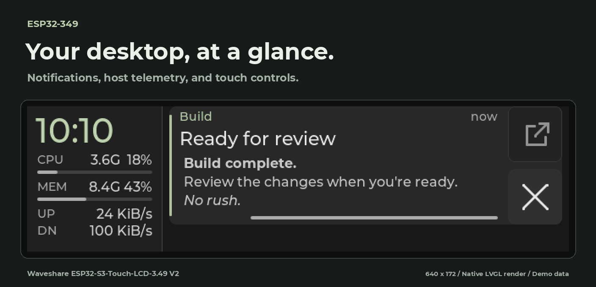
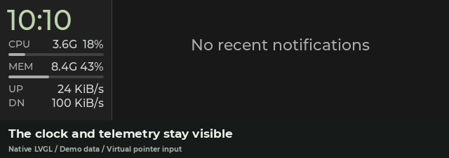
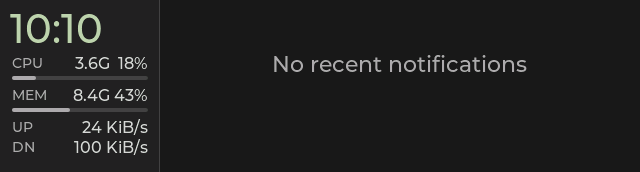
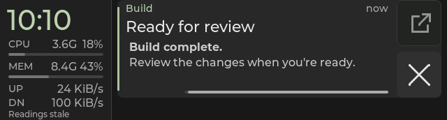

# notification-panel

A **640 × 172 desktop notification display** for the
[Waveshare ESP32-S3-Touch-LCD-3.49 V2](https://docs.waveshare.com/ESP32-S3-Touch-LCD-3.49).
A Linux host sends telemetry and notifications over USB Serial/JTAG.

*Production LVGL with demo notifications, virtual time and pointer input.
[Media provenance](docs/media/README.md).*

- Fixed clock, CPU/MEM utilization bars and uplink traffic readings.
- Up to 32 recent cards, retained for ten minutes independently of popup timeout.
- Vertical whole-card browsing, × dismissal and optional Open through DMS.
- English and common Simplified Chinese text, with Latin bold/italic body spans.
- One-time USB pairing and verified reconnects to the saved board.
- Backlight follows host screens and turns off after five minutes without the daemon.
- Physical brightness cycles 25/50/75/100%; Power toggles manual off, starting at 50%.
- Fresh notifications briefly boost brightness to 100%, then restore the selected level.

## Start here

Follow [setup and daily commands](docs/setup.md) to build/flash the firmware,
install `349d`, and pair the display. Commands in the application guides run
from `projects/notification-panel/` unless stated otherwise.

| Guide | Covers |
| --- | --- |
| [Setup and daily commands](docs/setup.md) | Prerequisites, firmware, host service, pairing, flashing and `349ctl` |
| [Configuration](docs/configuration.md) | TOML settings, bounds and reload behavior |
| [Display behavior](docs/behavior.md) | History, text, touch/Open, telemetry, connection states and older peers |
| [Tests and evidence](docs/testing.md) | Host, provider, firmware and production native checks |
| [Validation checkpoint](STATUS.md) | Dated source, automated results and physical acceptance scope |
| [Architecture](docs/architecture.md) | Host/firmware ownership, USB sessions, Open identity and rendering decisions |
| [Wire protocol](docs/protocol.md) | Capabilities, atomic snapshots, retention, styles and action correlation |
| [UI design](docs/ui.md) | Geometry, palette, typography, gestures and motion |
| [Backlight policy](docs/backlight.md) | Dimming circuit, physical controls, screen following and notification boosts |

## In motion

*Demo notifications and virtual pointer input/time;
[source and regeneration](docs/media/README.md).*

## Other states

| Empty history | Stale host readings |
| --- | --- |
|  |  |

Shared board support and repository development commands are in the
[repository guide](../../docs/development.md).
