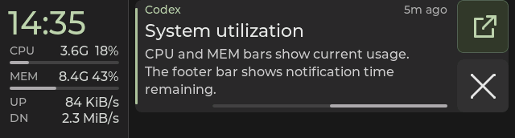
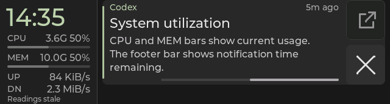

# CPU and MEM utilization bars

Implemented on 2026-10-07. The initial version was flashed on Starship, where
the user reported that CPU, its bar, MEM, its bar and UP felt cramped. The
spacing revision below passes native checks and the firmware build and is now
flashed on Starship with mirroring restored. The user accepted the revised
spacing on-panel: "I like this better."

The 160 px telemetry rail adds one neutral bar beneath CPU and one beneath
MEM. Each track is 136 × 4 px, starting at x=12; their y positions are 76 and
108. CPU and MEM each occupy a 32 px block rather than the original 24 px row.
The text positions are y=52, 84, 116 and 136 for CPU, MEM, UP and DN, respectively.
The bars have extra space above and below them, instead of filling the original
row gaps. UP and DN use a 20 px step to fit the expanded usage blocks. Clock,
footer, fonts and horizontal columns retain their existing geometry.
Normal, full-usage and stale captures have at least seven clear pixel rows
between each bar and the text above and below it.

The tracks and fills use the notification expiration bar's existing gray
colors and rounded ends. Utilization fills from the left: 18% usage fills
18% of the track. The notification footer continues showing remaining lifetime
with its segment anchored on the right. Neither type of bar is interactive.



The bars consume the existing CPU and memory usage fractions. The host's
one-second sampling, CPU smoothing, memory accounting and protocol remain
unchanged. Two widgets are created during UI initialization; updates reuse
them with animations disabled. Opacity changes only on a stale/fresh transition.

Measured zero has an empty track alongside `0%`. Unavailable usage has an empty
track alongside `--`, independently for each row. Missing frequency or used-memory
details do not suppress a valid usage bar. Stale readings retain their last
level with the fill at half opacity; fresh readings restore full opacity.



The same bars remain visible in empty history and older dashboard views.
The [capture manifest](telemetry-rail-usage-captures/manifest.json) records seven
native frames and their source/output hashes. These are production LVGL renders
with virtual data and time, not board photographs.

## Validation

- All 13 native CTests pass in Debug and Release, including composed host,
  parser/state, LVGL input, legacy renderer and link-receiver checks.
- The publication review passes 387 host/tooling tests with three desktop-bus
  integration tests skipped in the isolated environment. Notification-identity
  regressions run against the required private `dbus-broker`. All ten desktop
  action-provider tests pass.
- All 86 grouped captures are byte-identical between Debug and Release.
- Compared with the initially flashed bar layout, all 86 grouped captures
  change only within the telemetry rail at y=52–155. The text rows intentionally
  move; the clock, footer, right-side content and notification expiration bar
  have identical pixels.
- Added checks verify rendered zero/half/full levels and left-to-right fill,
  missing usage/detail independence, stale dimming/recovery, the unchanged
  100% font and column geometry, and rail ownership for a gesture starting on a bar.
- The ESP-IDF 5.5.3 build passes with the same configuration values as the
  retained pre-layout build. App size is 3,822,320 bytes, with 54% of the
  8 MiB app partition free.

The complete native run exposed two pre-existing composed fixture failures:
their controlled notification owner/PID lacked the source's new `ready`
identity state. Both failures reproduced with the pre-change native renderer.
The fixtures now establish that state, matching the existing host action tests;
all original Open/body assertions remain intact. Host production code is unchanged.

| Candidate identity | Value |
| --- | --- |
| Build version | `f5a31a4-dirty` |
| Application SHA-256 | `56a9539b64291dd355166fc4e4cde32523c233b08d053318ef8aaefd96b260dc` |
| ELF SHA-256 | `a48cf47a5c3b94c075f9a134d573ffb18826fdeca89f567d608c895ec8ea2780` |

The accepted firmware was built before publication, so its version stamp retains
the implementation base and `-dirty` suffix. The capture manifest's source hashes
identify the reviewed UI and native fixture independently of that stamp.

Local build, baseline comparison and check logs are under the project's ignored
`.cache/rail-bars/`. The initial bar layout's application/ELF and captures are
retained in `.cache/rail-bars/spacing-baseline/` for comparison and rollback.

## Initial Starship deployment — 2026-10-07

The user authorized flashing the attached Starship 349, USB serial
`28:84:85:92:C2:20`. The initial candidate's source and artifact hashes were
verified before the daemon's sticky pause released that exact serial port.

Two attempts to read the entire 16 MiB flash exceeded their three-minute
timeouts before any write. Both reader processes exited, and an explicit
`usb_reset` restored bootloader access. These attempts produced no complete
full-flash dump.

The retained previous application (`f23d215`, ELF prefix `c87b1b841`) and current
partition table were then verified against hardware using esptool's flash
digests. The verified application binary/ELF, partition image, daemon config,
saved pairing, source diff and deployment logs are preserved under:

```text
~/.local/share/esp32-349/backups/rail-usage-starship-20261008T040939Z/
```

This is a verified application rollback backup, not a full-chip dump. The
deployment wrote only the application at `0x10000`; bootloader, partition table
and other flash regions were preserved. Esptool used `--before usb_reset`
and `--after hard_reset`, wrote 3,822,272 bytes in 19.5 seconds, and verified
the flash hash.

At **21:16:13 PDT**, the daemon received `build=f5a31a4-dirty` and ELF SHA prefix
`20645e055`, matching the validated candidate. It resumed without a service
restart: systemd main PID remained `1099649`, Python PID remained `1099653`,
and automatic restart count remained zero. Config and saved pairing stayed
byte-identical to their backups.

Post-deployment IPC and device readback confirmed a live, unpaused link to the
paired board, boot ID `2841720444`, history/body-style/action negotiation,
ready notification-source/provider identity, and no pending action. One normal
sample had four retained cards on both host and device, a non-stale deck, and
matching CPU/MEM/traffic/detail readings. No synthetic notifications were sent.

These checks establish deployment and state restoration. Panel readability,
touch behavior and performance remain separate observations. The user's
subsequent on-panel feedback identified cramped spacing and prompted the
32 px usage blocks described above.

## Spacing revision deployment — 2026-10-07

The revised layout was flashed on the same paired Starship board. Before the
write, esptool verified the initially flashed application (ELF prefix
`20645e055`, binary SHA-256 `6ee0df337a69997959abc86cc49b86872efc5e5ce1d668f16be743bc668d129b`)
and the partition table against hardware. The verified rollback images,
new candidate, config, saved pairing and deployment evidence are preserved at:

```text
~/.local/share/esp32-349/backups/rail-usage-spacing-starship-20261008T042550Z/
```

Only the application at `0x10000` was written, using the same explicit
`usb_reset`/`hard_reset` sequence. Esptool wrote 3,822,320 bytes in 19.5 seconds
and verified the flash hash. At **21:26:26 PDT**, the daemon received ELF SHA
prefix `a48cf47a5`, matching the spacing candidate above.

The daemon resumed with main PID `1099649` unchanged; config and pairing
remained byte-identical. Device boot ID changed from `2841720444` to
`198803173`. Post-flash checks confirmed history/body-style/action negotiation,
three retained cards on both host and device, and a non-stale deck with live
telemetry. No synthetic notifications were sent. After the revision was flashed,
the user accepted its on-panel spacing with "I like this better" and requested
review, commit and push. This records acceptance of the visual spacing alongside
the automated rendering and runtime checks above.
