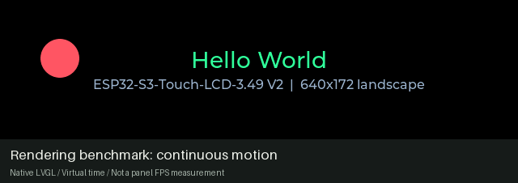

# render-bench

A landscape **640 × 172 bouncing-ball benchmark** for the
[Waveshare ESP32-S3-Touch-LCD-3.49 V2](https://docs.waveshare.com/ESP32-S3-Touch-LCD-3.49).



*Native LVGL with virtual time; [media source and regeneration](docs/media/README.md).
Playback timing is separate from measured panel performance.*

Recorded board trials reached about **45 fps**, with low CPU use and no
observed artifacts. The [rendering findings](docs/rendering.md) preserve the
experiment history; those measurements describe this benchmark.

The optimized board/display pipeline lives in the shared
[display_349 component](../../components/display_349/README.md), also used by
notification-panel. This application was previously `examples/349-hello/`.

## Build and flash

Run from `projects/render-bench/` after installing the
[common toolchain](../../docs/development.md#build-a-project):

```sh
. ../../scripts/env.sh
idf.py build
board_port='/dev/serial/by-id/usb-Espressif_USB_JTAG_serial_debug_unit_<serial>-if00'
idf.py -p "$board_port" flash monitor
```

Replace `<serial>` with the intended board's identity. If `349d` is running,
pause it before flashing and leave it paused while using this benchmark.
Flash notification-panel again before resuming the daemon; see its
[pause/resume procedure](../notification-panel/docs/setup.md#flashing-while-the-daemon-runs).

## Documentation

- [Rendering pipeline and hardware findings](docs/rendering.md): QSPI constraints, shadow framebuffer, DMA, touch mapping and performance history.
- [Repository development](../../docs/development.md): toolchain, layout, shared checks and migration.
